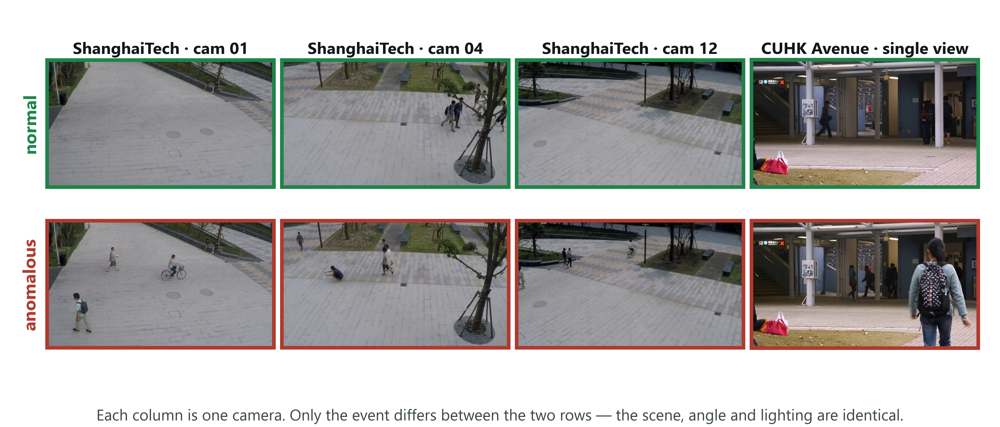
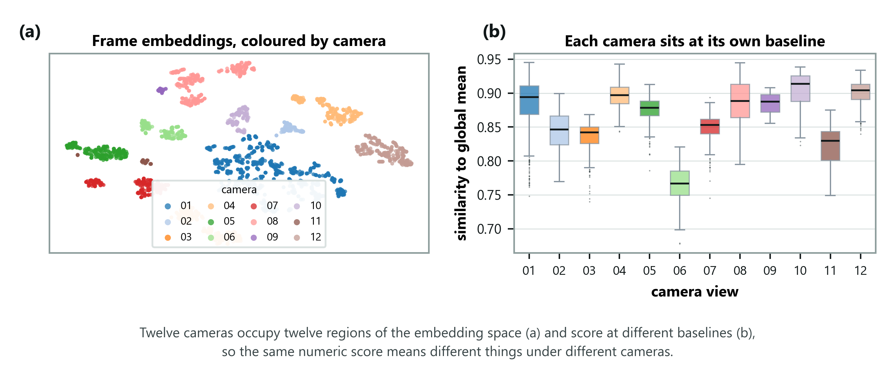
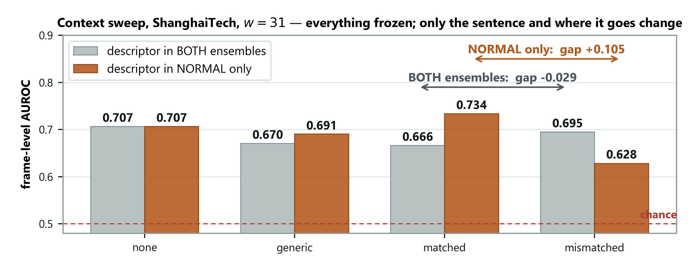
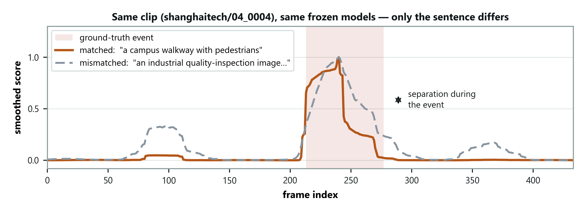
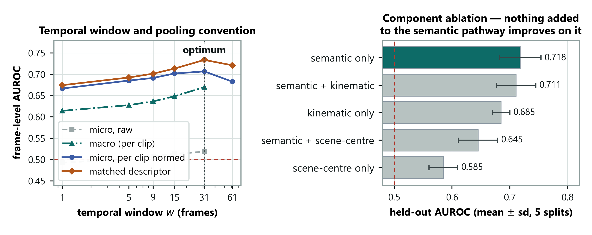
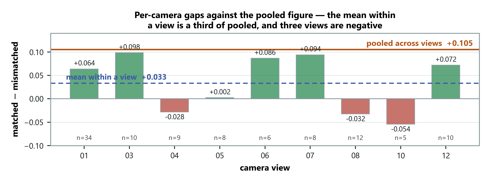

# DA-ZVAD — Phase 2 Presentation Script

*Domain-Adaptive Zero-Shot Video Anomaly Detection with Vision-Language Models.
Slide by slide, in order, with the transition into each next slide written out.
Runs about 26 minutes; the cut list at the end takes it to 19.*

---

## How to use this

Learn the **beat** of each slide — the one thing it exists to say. Sentences worth saying
exactly as written are marked **SAY**; everything else, put in your own words. A recited
talk sounds recited.

Every slide also carries an **In plain words** block in a tinted box. That is the slide
explained to somebody who does not work in this field — no notation, no term left
undefined, and for the slides that cover something we built, an account of *how* it was
built rather than of what it scores. It is written to be said aloud roughly as it stands.
Use it as your default register and drop into the technical wording only when a panelist
asks for it. A panel that follows you is a panel that asks good questions; a panel that
has lost the thread asks whether you wrote this yourself.

Each slide ends with a **→ Next** line. That sentence is the bridge into the following
slide, and it is what turns thirty slides into one argument. If you learn nothing else
from this document, learn the bridges — a talk that flows is mostly a talk where no slide
arrives without warning.

Two physical habits matter more than any sentence here. **Point at the screen with your
hand** when a slide has a figure or a table; the panel follows your finger, not your words.
And when you reach something that did not work, **slow down instead of speeding up** — the
failures are the most credible material you have.

---

---

# Part 1 — Framing (slides 1–4)

## Slide 1 — Title · 20s · *running 0:20*

**On screen:** title, your name, supervisors, the one-line summary.

**The beat:** set expectations, including that there is a negative result coming.

> **In plain words.** A security camera system that spots unusual events has to be
> taught what "usual" looks like at that particular camera, using weeks of its own
> footage. Move it to a new place and you start over. What I built lets you move it
> by typing one sentence describing the new place. Nothing is retrained — and part
> of the talk is about the version of this that failed before it worked.

Do not read the slide. They can read.

**SAY** — "This is Phase 2 of my thesis work: domain-adaptive zero-shot video anomaly
detection. The one-line version is that I adapt a detector to a new environment by writing
a sentence, with no training and every model frozen. I'll show you what worked, and also
the part that didn't."

That last clause is worth more than anything else on this slide. It tells the panel you are
not selling, which changes how they listen for the next twenty-five minutes.

**→ Next:** "Let me start with why moving a detector is hard at all."

## Slide 2 — The problem · 60s · *running 1:20*

**On screen:** mall vs factory, the same forklift, opposite answers.

**The beat:** normality is a property of the place, not the object.

> **In plain words.** The reason you cannot just copy a detector from one site to
> another is not that the new camera looks different. It is that the *rule* is
> different. A forklift is an emergency in a shopping mall and completely ordinary
> in a warehouse — and no amount of adjusting for lighting or camera angle will
> ever tell you which building you are in.

Lead with the example, never the definition.

A detector learns what "normal" looks like from weeks of footage at one camera. Move it
somewhere else and it fails. Today that means every new site needs new footage and a full
retraining cycle — and that cost is what this project removes.

Then the picture: a forklift moving through a shopping mall is an immediate alarm. The
identical forklift on a factory floor is completely routine.

**SAY** — "Same footage. Opposite answers. The picture did not change — the rule did."

**→ Next:** "That distinction has a name in the literature, and where the literature puts
its attention is the gap I'm working in."

## Slide 3 — Research gap, 1 of 2 · 75s · *running 2:35*

**On screen:** the covariate/concept shift table, and the Liu quotation.

**The beat:** the field excludes concept shift by explicit decision.

> **In plain words.** When researchers talk about moving a model to a new place,
> they almost always mean the pictures look different — fog instead of sunshine.
> They say openly that they are setting aside the other case, where the picture is
> the same and the correct answer changes. For recognising objects that is a
> sensible thing to set aside. For anomaly detection it is the entire problem.

This is the slide that proves you read the six surveys your supervisor assigned. Slow down.

Domain adaptation splits the differences between two places into kinds:

- **Covariate shift** — the appearance moves. A stop sign in fog versus sunshine. Still a
  stop sign.
- **Concept shift** — the rule moves. A bicycle on a road versus on a footpath. Identical
  image, opposite label.

**Read the Liu quotation aloud off the slide.** Then:

**SAY** — "The field scopes concept shift out by explicit decision. And for object
recognition that is the right call — a cat is a cat everywhere. But anomaly detection is
built on concept shift."

Make clear you are not criticising them. The scoping is correct for their problem.

**→ Next:** "So let me show you why that scoping is a problem specifically for anomaly
detection."

## Slide 4 — Research gap, 2 of 2 · 60s · *running 3:35*

**On screen:** the three-row table — running, lying down, a vehicle — normal in one domain,
anomalous in the other.

**The beat:** in this task, normality *is* the deployment context.

> **In plain words.** In this task "normal" is not a property of the object, it is
> a property of the place. So the thing the field set aside is the thing I am left
> holding. That is the gap: not that anyone was careless, but that the tools were
> built for a different kind of difference than the one anomaly detection has.

Walk one row only. A person running is normal in a park and anomalous in a bank vault.

**SAY** — "In anomaly detection, normal is defined by the deployment context, not by the
object. That is the definition of the task."

The consequence: methods that align appearance cannot help here, because the appearance is
already identical. Two domains can share the input distribution exactly while the labelling
function differs.

**Volunteer the concurrent work.** A 2026 position paper reaches the same premise
independently. Saying that yourself answers "did you invent this problem?" before it is
asked. What is still missing in the literature is a test of whether supplied context
actually does any work.

**→ Next:** "That test is what I built. Here is the system."

---

---

# Part 2 — The architecture (slide 5)

This is the slide you will spend the most time on and take the most questions on. Budget
three and a half minutes and expect to be interrupted.

## Slide 5 — DA-ZVAD: adapt by writing a sentence · 3m30s · *running 7:05*

### What the diagram exists to prove

Before any of the boxes, be clear in your own mind about the claim the picture makes. It is
not "here is a pipeline." It is:

> **Exactly one thing in this system can vary, and it is a sentence. Everything else is
> frozen. So if performance moves, the sentence moved it — there is no other candidate.**

Every design choice in the figure serves that claim. If you keep that sentence in mind, the
walkthrough tells itself.

### The thirty-second version, if you get cut short
> **In plain words, before any of the boxes.** Video comes in on the left. A person
> types one sentence about where the camera is. Both go through models that were
> already trained by somebody else and that I never modify. They meet in the middle,
> where each frame gets a score for how much it looks like the written description of
> "something wrong" rather than the written description of "an ordinary day here".
> That score is smoothed over about a second, and anything that stays high gets
> flagged and described in words. To move this to a new building, you edit the
> sentence. That is the entire deployment procedure.

**SAY** — "Video comes in on the left and goes through a frozen CLIP image encoder. An
operator writes one sentence describing the scene, and that goes through a frozen CLIP text
encoder. The two meet in the middle, where each frame gets a score for how much more it
looks 'abnormal' than 'normal'. That score is smoothed over time, thresholded, and a frozen
LLaVA writes an explanation. Nothing trains. Deploying to a new site means editing the
sentence."

### Stop 1 — Two inputs, and why they are drawn separately

> **In plain words.** Two arrows come in, not one, and that is deliberate. The
> camera supplies pictures. A *person* supplies the place, by typing a sentence.
> If I had drawn one arrow feeding both branches it would suggest the system works
> out the location from the video by itself — it does not, and that separation is
> the whole method.

Start at the far left. There are **two** input panels, not one, and the separation is
deliberate.

**VIDEO** is the camera: frames, with the current frame highlighted in amber. **OPERATOR**
is a person, and all they supply is one sentence.

**SAY** — "I've drawn these separately on purpose. A single input feeding both branches
would suggest the system learns the domain from the video. It doesn't. The video supplies
frames; a human supplies the domain, in words. That separation is the method."

Point at the italic line under the operator box: *the only input that changes per site.*
That is the deployment story in six words.

### Stop 2 — M1, the visual branch

> **In plain words.** How this part was built: I did not build it. It is an
> off-the-shelf model called CLIP, which somebody trained on hundreds of millions of
> pictures paired with their captions. Because of that training it puts a photograph
> and a sentence describing that photograph in the same place. I use it exactly as
> shipped — I feed it a frame, and it hands back a list of 768 numbers standing for
> what is in that frame. The snowflake means I never touch its settings.

Frozen CLIP image encoder, ViT-L/14, pretrained on LAION-2B. It turns each frame into 768
numbers scaled to unit length.

**SAY** — "CLIP was trained on hundreds of millions of image–caption pairs, so it puts a
picture and a sentence describing that picture in the same space. Here it turns each frame
into 768 numbers. The length is normalised away, so only the direction carries meaning —
and the direction encodes what is in the frame."

The snowflake is doing real work. Say it: nothing here is trained, and nothing here is
trained on my data. This is an off-the-shelf model used as-is.

### Stop 3 — M3, the language branch — the heart of the method

> **In plain words.** This is the part I actually built, so let me go slowly. I
> keep two short lists of phrases: things you would write about a normal scene, and
> things you would write about an alarming one. The operator's sentence — "a campus
> walkway with pedestrians" — gets pasted onto the ends of the *normal* list only.
> Each list is then run through the same off-the-shelf model and averaged down to a
> single summary. So I end up with two reference points: one meaning "normal here",
> one meaning "abnormal". Pasting the sentence onto one side rather than both is one
> line of code, and it is the difference between the method working and the method
> inverting. I will show you that in about ten minutes.

Slow down. This is the module the thesis is about.

**The scene sentence.** *"a campus walkway with pedestrians."* One sentence, written by a
person, describing where the camera is.

**Two prompt sets.** `P+` holds the "normal" phrases, `P-` the "abnormal" ones — short
ensembles rather than single sentences.

**The critical detail. Point at the small orange label.** The scene sentence is appended to
`P+` **only**.

**SAY** — "This is the single most important arrow in the diagram, and getting it wrong
cost me a month. The scene description tells the model what normal looks like *here*. An
anomaly is then whatever departs from that. If I add the description to both sets, the same
words land on both sides of the comparison and the two sides collapse toward each other —
which is exactly what happened in my first run. I'll show you that result shortly."

That forward reference matters. It ties the architecture to the results and shows the design
was earned rather than assumed.

**The frozen text encoder.** Each prompt is encoded and normalised, the set is averaged into
one vector, and that average is normalised again — giving two **prototypes**: one summary
vector for "normal here," one for "abnormal."

### Stop 4 — Frame scoring, where the branches meet

> **In plain words.** Now the two branches meet. I have a frame as numbers, and two
> reference points as numbers. I measure which of the two the frame is closer to,
> and turn that into a value between 0 and 1. There is no classifier here that I
> trained — the entire decision is which of the two written descriptions the picture
> resembles more. And I should be precise about what the number means: it is *how
> much more* abnormal than normal the frame reads, not the probability that
> something bad is happening.

The two prototypes sit at the top of the panel; the frame vector arrives from the left. The
operation is a softmax over two similarities — how well the frame matches the normal
prototype, and how well it matches the abnormal one, each scaled by a factor. The output is
the probability the frame is abnormal.

Two details worth volunteering, because they show you know your own code:

**On the scaling factor** — **SAY** "That's not a hyperparameter I chose. It's CLIP's own
logit scale, around 100, learned during CLIP's pretraining and shipped with the weights. I
use it as-is."

**On what the score means** — **SAY** "It's between 0 and 1, and it's a *relative* quantity:
how much more the frame reads abnormal than normal. It is not a calibrated probability that
something bad is happening."

That second point pre-empts a calibration question and shows you know the limits of your
own number.

### Stop 5 — M2, temporal smoothing

> **In plain words.** Frame-by-frame scores jump around. So I replace each frame's
> score with the average of it and the fifteen frames either side — about a second
> in each direction. One freak frame can no longer raise an alarm, but a real event
> lasting a couple of seconds still stands out clearly. There is nothing learned in
> this step at all; it is an average. The little plot inside the box shows it: thin
> grey is before, thick blue is after, the shaded band is the real event.

A centred moving average over a 31-frame window. No parameters at all.

**SAY** — "Per-frame scores are noisy. This averages each frame with the fifteen before and
the fifteen after — about a second either side — so a single odd frame can't raise an alarm,
but a sustained event still stands out."

Point at the small plot inside the panel: thin grey is the raw score, thick blue is smoothed,
the shaded band is the actual event. That picture answers "what does smoothing do" faster
than any sentence.

If asked why 31: it came from a sweep, and it has a real optimum — performance rises to 31
and falls after. Concede immediately that no validation split exists for these benchmarks,
so it was selected on held-out clips rather than a clean validation set.

### Stop 6 — M4, detection and explanation

> **In plain words.** Once a stretch of frames crosses the threshold, I pick the
> single worst frame from that stretch and hand it — along with the same operator
> sentence — to a second off-the-shelf model that can look at a picture and write
> about it. Only one frame per event, so the expensive part runs a handful of times
> per video rather than thousands. I should say plainly that this part is built and
> runs, but has not produced video results yet. It is the first thing on the Phase 3
> list.

The smoothed score is thresholded. Then a frozen LLaVA-1.5, running 4-bit, writes a sentence
explaining what it sees.

**Be honest in the same breath.** **SAY** — "M4 is built and it runs, but it has produced no
video results yet. That's the first item that isn't finished, and it's on the Phase 3 list."

Volunteering that is far stronger than being caught by it. Note also the orange line under
the explanation box: the explanation is grounded by the *same* sentence. One sentence steers
both the detection and the words used to describe it.

### The line along the bottom

Read it out — it is the summary of the whole figure:

> **Deploying to a new site = editing the sentence · no target data · no gradients · every model frozen**

The smaller line beneath it — scores min–max normalised per clip before pooling, following
the benchmark's protocol — is there because it is the bug that cost the first run. It
belongs on the figure precisely because it is easy to get wrong.

### Three things to point at with your hand

If the room is only half-listening, these three gestures carry the argument.

- **The snowflakes.** Sweep across all four. "Nothing in this system trains."
- **The orange arrow into `P+`.** "The sentence enters one side of the comparison, not both."
- **The operator box.** "This is the entire deployment cost. A person writes one sentence."

### Questions they will stop you with here

**"Which domain adaptation technique is this?"** — None of the classical four. Fine-tuning,
discrepancy alignment, adversarial adaptation and self-training all change weights using
target-domain data, and I have neither target data nor gradients. They also all align the
input distribution — they make source and target *look* alike — which only helps if the
labelling function is stable. My problem is the reverse: a bicycle on a walkway and one on
a road are the same pixels with opposite labels, so there is nothing to align. What I use is
the foundation-model technique: adaptation through the input context with the model frozen.
In the field's vocabulary — source-free, test-time, training-free, language-mediated,
concept-shift-oriented.

**"Why isn't that on the standard list?"** — Because the vision DA surveys run 2015 to 2023
and predate foundation-model adaptation. There was no frozen model you could steer with a
sentence when those taxonomies were written. That absence is the gap this thesis is about.

**"Isn't CLIP already trained, so it isn't really training-free?"** — CLIP is pretrained,
yes, and I say so. What is training-free is the *adaptation*: no gradient step is taken on
either benchmark and no target data is used at any point.

**"Why not patch-level features?"** — Whole-frame embeddings at 224×224 cannot resolve small
objects, and that's a stated limitation. Patch-level scoring is item three on the Phase 3
list and the most likely route to a materially higher number.

**→ Next:** "The freezing isn't modesty about compute. It's the thing that makes the claim
testable, and that's worth one slide on its own."

---

---

# Part 3 — Method rationale and protocol (slides 6–9)

## Slide 6 — Why freezing everything is the point · 60s · *running 8:05*

**On screen:** the risk, the design, the consequence, and the identifiability callout.

**The beat:** freezing is what makes the claim attributable rather than asserted.

> **In plain words.** Here is the reason nothing in the system is allowed to learn.
> If any part of it adapted to the new site on its own and the numbers went up, I
> could never say whether the sentence did it or the learning did. By bolting
> everything down, I leave exactly one thing free to change. Then if the number
> moves, there is only one thing that could have moved it. That is not me being
> frugal with GPU time — it is the only way to make the claim checkable.

The strongest methodological point in the deck. Say it slowly.

- **The risk.** If the system learned even a little from the new site and performance
  improved, I could not say what caused it — the sentence, or the learning.
- **The design.** No parameter anywhere is allowed to change. Exactly one thing can vary:
  the text.
- **The consequence.** **SAY** — "So any measured difference is attributable to the
  sentence. There is no other candidate."

Then the point that lands hardest: **you cannot run this experiment on the competing
systems.** Their text is learned on source data, or entangled in an LLM prior, or paired
with a trained adapter. Freezing is what makes the claim falsifiable rather than rhetorical.

**→ Next:** "And falsifiable means there has to be a way for me to be wrong. Here's the
protocol."

## Slide 7 — A protocol that can prove us wrong · 60s · *running 9:05*

**On screen:** the four conditions — none, generic, matched, mismatched — and the predicted
signature.

**The beat:** the interpretation was fixed before any measurement.

> **In plain words.** How I built the test: run the whole system four times over
> the identical video, changing nothing but the sentence. Once with no sentence.
> Once with a meaningless one. Once with a correct description. And once with a
> description of somewhere else entirely. That last run is the important one — if
> feeding the system a deliberately wrong description costs it nothing, then it was
> never reading the sentence and my whole idea is wrong. I wrote down what each
> outcome would mean before I ran any of them.

Run the identical pipeline four times, changing only the sentence. *Generic* controls for
merely having context at all. *Mismatched* is the falsifying control.

**SAY** — "I fixed the interpretation before measuring anything: matched at least generic,
generic at least none, and mismatched measurably worse. If a deliberately wrong description
costs nothing, the method is ignoring its context and my claim is refuted."

A panel respects a test you could have failed. Then add: "and later in this deck, one I
partly did."

**→ Next:** "So — what that ran on."

## Slide 8 — What we ran · 30s · *running 9:35*

**On screen:** benchmarks, scale, hardware, backbone, run count, and the manifest note.

**The beat:** provenance. Keep it brief and let the content do the work.

> **In plain words.** Every time a run finishes, the code automatically writes a
> small record beside the results: which version of the code ran, on which machine
> and graphics card, with which library versions, and how many frames and labels it
> actually saw. I did not do that by hand afterwards. It means any number in this
> talk can be traced back to the exact state of the project that produced it.

Two benchmarks, 128 test clips, 28,118 frames with frame-level ground truth. College A40.
Frozen CLIP ViT-L/14. Five full runs.

**SAY** — "Every run writes a manifest — the code commit, whether the working tree was clean,
the host, GPU, driver and library versions, the full configuration, and the frame and label
counts. It's committed alongside the results, so every figure in this deck traces back to the
state that produced it."

**Then offer it out loud:** if anyone would like to see a manifest, you can open one. If the
panel has any doubt about provenance, that offer is the answer.

**→ Next:** "And it's worth thirty seconds on what this data actually looks like, because
the pictures make the argument better than I can."

## Slide 9 — What the two benchmarks actually look like · 30s · *running 10:05*

**On screen:** the grid of normal and anomalous frames, one camera per column.

**The beat:** the concept-shift argument, as a photograph.

> **In plain words.** Look down any one column. It is the same camera, same angle,
> same lighting, in both pictures. The only thing that changes is what is happening
> in the frame — and the label flips from normal to anomalous. That is the whole
> argument of the first four slides, sitting in a photograph.

Thirty seconds, no more. Point down one column.

**SAY** — "Each column is one fixed camera — the scene, the angle and the lighting are
constant. Only the event changes. An empty walkway and the same walkway with a cyclist look
nearly identical to a computer, and they're labelled opposite. So the label cannot be a
property of how the scene looks."

If someone later challenges whether concept shift is real or contrived, come back to this
slide. It is the argument in a photograph.

**→ Next:** "So that's the setup. Now what actually happened — and the first thing that
happened is that it failed."

---

---

# Part 4 — Failure and diagnosis (slides 10–13)

## Slide 10 — The first result was a failure · 45s · *running 10:50*

**On screen:** 0.49, and the inverted condition table.

**The beat:** land the failure honestly. Do not rush and do not apologise.

> **In plain words.** The first complete run came back at 0.49. Half. A coin flip
> would have done as well. And the central experiment came out backwards: the
> correct description performed worse than the deliberately wrong one. I want to
> show you this rather than skip to the version that works, because everything
> useful in the project came out of taking it apart.

**0.49 AUROC.** Fifty minutes of GPU time to produce a detector performing exactly as well
as a coin flip.

And the central experiment came out **backwards**: the *matched* description — the correct
one — was worst at 0.666, and the *mismatched* description, deliberately wrong, was among
the best at 0.695.

**SAY** — "This is the point at which the idea looks broken."

Then **pause.** Let it sit for two seconds. The next three slides are why this talk is worth
listening to.

**→ Next:** "There turned out to be two separate problems. The first one wasn't in the
method at all — it was in how I was measuring."

## Slide 11 — Diagnosis 1: we were measuring it wrong · 75s · *running 12:05*

**On screen:** the twelve views, the error, the analogy, and 0.49 → 0.71.

**The beat:** a measurement bug, fixed with no labels, using the benchmark's own protocol.

> **In plain words.** The first problem had nothing to do with my idea. This
> dataset has twelve different cameras, and the model naturally scores some cameras
> higher than others simply because of how they look. I had thrown every frame from
> all twelve cameras into one big pile and ranked them together. It is like ranking
> students from twelve schools on raw marks when the schools mark to different
> standards — you destroy the ordering that was correct inside each school. Ranking
> within each clip first, then combining, took the same scores from 0.49 to 0.71.
> No labels involved, and it is the dataset's own published procedure. I simply had
> not been following it.

ShanghaiTech has 12 camera views, and CLIP sits at a different baseline score under each —
different lighting, different angle. My error was pooling every frame from all twelve into
one ranking.

**Use the analogy. It works on everyone.**

**SAY** — "It's like ranking students from different schools by raw marks when the schools
grade differently. The comparison destroys the ordering."

Normalising each clip before pooling took the identical scores from **0.49 to 0.71**.

**Stress two things, twice if needed:** the fix **uses no labels**, and it is the benchmark's
**own published protocol** — I simply wasn't following it. And say that both figures appear
in the paper.

**→ Next:** "That's a strong claim to make about your own bug, so let me show you the
evidence for it."

## Slide 12 — The evidence for that diagnosis · 45s · *running 12:50*

**On screen:** two panels — the embedding projection coloured by camera, and per-view
similarity.

**The beat:** the diagnosis was not invented after the fact.

> **In plain words.** I did not want to just assert that explanation, so here is
> the check. I took every frame, flattened it onto a two-dimensional map, and
> coloured each point by which camera it came from. The cameras land in separate
> clumps. Neither picture uses the answer key at all, so this is not me
> rationalising after the fact — it is the cause, visible directly.

Left: every frame projected to two dimensions and coloured by camera — the views sit in
**separate regions**. Right: how similar each view is to the average frame, differing by more
than 0.13 between views.

**SAY** — "Neither panel uses labels, so this isn't hindsight. The cameras occupy separate
regions of the space at different similarity levels, which is exactly why pooling raw scores
destroyed the ordering."

**→ Next:** "That fixed the number. It did not fix the inversion — the correct description
was still the worst one. That was a second, separate problem, and it's the more interesting
of the two."

## Slide 13 — Diagnosis 2: the description cancelled itself out · 90s · *running 14:20*

**On screen:** the two prompt sets with their shared words highlighted, and the fix.

**The beat:** the mechanism of the inversion — and why a *better* sentence did more damage.

> **In plain words.** The second problem was mine, and it is the interesting one.
> The system compares each frame against two written descriptions: one of normal,
> one of abnormal. I had been pasting the scene sentence onto *both* of them. Each
> side gets averaged into a single summary, so the same words landed on both sides
> and the two summaries drifted toward each other — and the whole method depends on
> them being far apart. I was rubbing out the very contrast I was measuring. Worse:
> an accurate sentence matches everything on screen, so it does the *most* damage.
> That is exactly why the better sentence scored worse. The fix was one line --
> attach the sentence to the "normal" side only, because the scene is what defines
> normal here and an anomaly is a departure from it.

The most interesting slide in the deck. Give it the time.

I had been appending the scene sentence to **both** prompt sets. Point at the two prompts and
let the panel see the shared words.

Each set is averaged into one summary vector. Shared text enters both, so the two summaries
move **toward each other** — and the whole method depends on them being different. I was
erasing the very contrast the decision rests on.

**The punchline, and it is a good one:**

**SAY** — "An accurate description matches every frame strongly, so it absorbs the most
contrast. A wrong one matches nothing, so it does no damage. That is exactly why the result
inverted — the better the sentence, the worse it performed."

**The fix:** attach the description to the **normal** prompts only. The scene defines what
normal looks like here; an anomaly is a departure from it.

**→ Next:** "So I re-ran the whole four-condition sweep with that one change. This is the
result the project exists to produce."

---

---

# Part 5 — The central result (slides 14–17)

## Slide 14 — After the fix: the predicted signature · 75s · *running 15:35*

**On screen:** the two-row injection-point table.

**The beat:** the headline number, and the control that makes it mean something.

> **In plain words.** Same models, same video, same everything — the only two
> things that vary are which sentence is supplied and which side it is attached to.
> Start with the first column, where no sentence is supplied at all: 0.707 in both
> rows. It has to be identical, because with no sentence there is nothing to attach
> anywhere. That column is my proof that nothing else changed between the two rows.
> Then look at 0.628: that is what a wrong sentence costs. Ten points, with nothing
> else in the system permitted to move.

ShanghaiTech, all 107 clips, per-clip normalised. Every model frozen; only the sentence and
its injection point vary.

| Injection point | none | generic | matched | mismatched | gap |
|---|---|---|---|---|---|
| Both prompt sets | 0.707 | 0.670 | 0.666 | 0.695 | −0.029 |
| Normal set only | 0.707 | 0.691 | **0.734** | **0.628** | **+0.105** |

**Point at the `none` column first.** It is 0.707 in both rows.

**SAY** — "That column is the control. It's identical in both rows, which confirms nothing
changed between them except where the sentence was injected."

Then point at 0.628.

**SAY** — "A wrong sentence costs ten points. Nothing else in the system was permitted to
change, so the text caused it."

**→ Next:** "Same numbers, drawn — because the thing that matters is a distance, and a
distance is easier to see than to read."

## Slide 15 — The same experiment, drawn · 30s · *running 16:05*

**On screen:** grouped bars, grey for both-sets, orange for normal-only.

**The beat:** the quantity of interest is the gap, and it changes sign.

> **In plain words.** The same numbers as a picture. Do not read the height of any
> single bar — the thing that matters is the *distance* between the matched bar and
> the mismatched bar. In grey, that distance runs the wrong way. In orange, it runs
> the right way. The only difference between grey and orange is which side of the
> comparison the sentence was pasted onto.

Trace the two arrows with your finger. The number the experiment exists to produce is the
**distance between the matched and mismatched bars**. With grey, that distance is negative.
With orange, it is +0.105.

**SAY** — "The only thing separating those two arrows is where the sentence was attached."

**→ Next:** "That's aggregated over a hundred clips. Here's what it looks like on a single
one, where there's nothing aggregated to argue with."

## Slide 16 — One clip, two sentences · 40s · *running 16:45*

**On screen:** two score curves over one clip, with the event marked.

**The beat:** the cleanest evidence in the deck — no aggregation involved.

> **In plain words.** Everything so far has been an average over a hundred clips.
> This is one clip. Two lines: the same frozen models scoring the same frames, and
> the only difference is whether the sentence describes a campus walkway or a
> factory. Outside the event they sit on top of each other — which is what should
> happen. Inside the event they separate. There is no averaging here for anyone to
> argue with.

Same frozen models, same frames, same smoothing. The only difference is whether the sentence
describes a campus walkway or an industrial site.

**SAY** — "The curves coincide outside the event — that's on purpose, that's the control —
and they separate inside it. Two runs over identical frames with identical frozen weights.
There's no aggregation here to argue with."

**→ Next:** "Now let me be precise about what I am and am not claiming from this, because
the two halves of the result are not equally strong."

## Slide 17 — Stating the claim precisely · 60s · *running 17:45*

**On screen:** the weaker half, the claim made, and the mechanism.

**The beat:** understate deliberately. This is where credibility is won.

> **In plain words.** I want to split my own result in half, because the two halves
> are not equally strong. Correct sentence versus no sentence: it helps, but only by
> about 0.027, and when I reshuffle which clips I test on, the numbers wobble by
> more than that. So I will say it points the right way and I will not claim the
> size of it. Wrong sentence versus correct: 0.105, far outside that wobble, and
> nothing else in the system was free to move. That one I will claim. The honest
> summary is that the sentence is doing real work, and what proves it is the damage
> from getting it wrong, not the benefit from getting it right.

**The weaker half.** A correct description beats no description by **+0.027**. Positive at
every smoothing window, but inside the ±0.036 split-to-split spread.

**SAY** — "So I report the direction, not the magnitude. I'm not claiming that number."

**The claim I do make.** A wrong description costs **−0.105**. Unambiguous, and nothing else
could have caused it.

**The mechanism** — **SAY** "The description constrains a decision boundary rather than
adding information. It doesn't reliably lift performance when it's correct; it degrades
performance sharply when it's misdirected."

**The secondary finding, not present in the literature:** *where* the description is injected
dominates *what* it says — to the point of reversing the sign of the effect.

**→ Next:** "That's the language pathway on its own. The obvious next question is whether
the other components I built are earning their place."

---

---

# Part 6 — Ablations and boundaries (slides 18–23)

## Slide 18 — Which components earn their place · 60s · *running 18:45*

**On screen:** the five-row scoring-signal table.

**The beat:** language alone wins, and a prediction of mine failed.

> **In plain words.** Having got it working, I checked whether every piece I built
> was actually earning its place. I tried scoring frames by how much they move
> instead of what they contain, by how far they sit from the clip's own average, and
> by combinations of those with the language pathway. Language on its own wins.
> I will point out the one that embarrasses me: I predicted motion would help,
> because a bicycle at cycling speed is the obvious example of an anomaly you would
> think needs motion to spot. It added nothing. The image model is evidently already
> picking up enough of the movement on its own.

| Scoring signal | Held-out AUROC | Full test set |
|---|---|---|
| Scene-centre normality only | 0.585 ± 0.025 | 0.585 |
| Semantic + scene-centre | 0.645 ± 0.034 | 0.640 |
| Kinematic — motion only | 0.685 ± 0.015 | 0.686 |
| Semantic + kinematic | 0.711 ± 0.034 | 0.706 |
| Semantic — language only | 0.718 ± 0.036 | 0.707 |

Language alone is best. Adding motion costs 0.001; adding scene-centre normality costs 0.067.

**Volunteer the surprise** — **SAY** "I expected motion to help and it doesn't.
ShanghaiTech's anomalies look kinematic — a bicycle at cycling speed — so appearance and
motion ought to be complementary. Measured here, they aren't. The pooled embedding already
registers enough of the motion."

Reporting a prediction that failed is stronger than reporting only the ones that held.

**→ Next:** "Both the smoothing window and those components are easier to judge as curves,
so — briefly."

## Slide 19 — Window length, and what each component adds · 35s · *running 19:20*

**On screen:** two panels — the window sweep, and the component comparison with error bars.

**The beat:** the window has a real optimum; the component differences do not survive their
error bars.

> **In plain words.** Left panel: smoothing helps up to about a second of averaging
> and then starts hurting. That matters — it means there is a real best setting,
> rather than the measurement simply rewarding more and more blur. Right panel: the
> error bars. Look at how much they overlap. So the honest reading is not "language
> beats the alternatives", it is "nothing I added beat plain language". That is a
> negative result about my own extra machinery.

Left: smoothing helps up to a window of 31 and then hurts — so the window has a genuine
optimum rather than the metric simply rewarding more blur. The grey curve is the wrong
pooling, and it never leaves chance.

Right: **volunteer the weakness before anyone asks.**

**SAY** — "The error bars overlap, so the top three are statistically tied. The honest claim
is that nothing I added beat plain language. That's a negative result about my own
elaborations, not a win over the alternatives."

**→ Next:** "Everything so far is one benchmark. The real test is whether any of it survives
a second one."

## Slide 20 — A second domain: the replication test · 75s · *running 20:35*

**On screen:** the two-dataset comparison table.

**The beat:** detection transfers, adaptation does not — and say so plainly.

> **In plain words.** A result on one dataset is not a result. So I took the system
> exactly as it stood, changed nothing, retuned nothing, and pointed it at a second
> benchmark — swapping only the sentence. Two different things happened. The
> *detection* transferred perfectly: 0.706 against 0.707. But the *adaptation*
> almost disappeared, and a meaningless placeholder sentence actually beat an
> accurate description. I am telling you that myself: whatever the sentence is doing
> on this second dataset, it is not domain adaptation.

Identical frozen configuration applied to CUHK Avenue. Nothing retuned. Only the sentence
changed.

| Dataset | none | generic | matched | mismatched | gap |
|---|---|---|---|---|---|
| ShanghaiTech (12 views) | 0.707 | 0.691 | 0.734 | 0.628 | +0.105 |
| CUHK Avenue (1 view) | 0.706 | 0.729 | 0.677 | 0.657 | +0.020 |

**Detection transfers.** 0.706 against 0.707 with no descriptor — the detector works equally
well on a dataset it was never tuned for.

**Adaptation does not.** The gap is five times smaller, and the correct description scores
*below* having none at all.

**Give the honest reading yourself** — **SAY** "On Avenue a placeholder beats an accurate
description. Whatever benefit the description is giving here, it cannot be domain
adaptation."

**If asked why Avenue trails the other methods** (it comes up again on slide 24), the
answer has two halves, and the second is the bigger one:

**SAY** — "It isn't the detector failing to transfer — with no descriptor the two
benchmarks give 0.706 and 0.707, identical. The first half is that a scene description has
nothing to resolve on a single-camera benchmark. The second half is that Avenue's anomalies
are a different *kind*. ShanghaiTech's are object categories — car, bicycle, motorcycle —
which is exactly what CLIP is built for. Avenue's include 'too close', where nothing is
semantically out of place and the anomaly is how *near* the object is. No sentence
expresses that. It's the same resolution limit I found on MVTec: whole-frame embeddings
capture what is in a scene, not how big, how fast or how near it is."

Then the conjecture, stated as a conjecture, with the experiment that tests it: ShanghaiTech
has twelve camera views and Avenue has one. A scene description has work to do only when
there are several environments to tell apart.

**→ Next:** "That's a comfortable story to tell about your own negative result, so I designed
a test that could have destroyed it."

## Slide 21 — We tested that explanation, and it held · 75s · *running 21:50*

**On screen:** the three-row pooled / within-view / Avenue table.

**The beat:** a complete research cycle — observation, explanation, falsifiable test, result.

> **In plain words.** I had a comfortable explanation for that — the second
> dataset has one camera, the first has twelve, and a scene description only earns
> its keep when there are several places to tell apart. Comfortable explanations for
> your own bad results deserve suspicion, so I built a test that could have
> destroyed it. The first dataset is really twelve single-camera datasets stacked
> together. So I ran the same experiment *inside* each camera separately. If my
> explanation were wrong, the effect would have stayed strong. It dropped to a
> third, landing right next to the single-camera dataset. The explanation survived a
> test it could have failed.

ShanghaiTech is effectively twelve single-view datasets stacked together. If the descriptor
works by telling the model *which* scene it is in, then confining the sweep to a single
camera view should reproduce Avenue's flat result.

| Evaluation | Views | Clips | Gap |
|---|---|---|---|
| Pooled across views | 12 | 107 | +0.105 |
| Within a single view (mean) | 9 | 5–34 each | +0.033 |
| CUHK Avenue (single view) | 1 | 21 | +0.020 |

**SAY** — "A within-view gap near +0.105 would have refuted this outright. It came back at a
third of that, sitting right next to Avenue's figure."

**Then give the caveat before they find it:** three of the nine views show a *negative* gap,
so inside a single scene the effect is not reliable.

**SAY** — "What the sentence mainly supplies is *which* scene you're in, not what counts as
normal within it. That's a narrower claim than I started with, and it's the one the data
supports."

Name what this slide is: a full cycle. Something odd was observed, an explanation was formed,
a test that could have killed it was designed and run, and it held.

**→ Next:** "And since I've just quoted an average of nine views, here they all are
individually."

## Slide 22 — Every camera view, one at a time · 35s · *running 22:25*

**On screen:** per-view bars against the pooled line.

**The beat:** show the spread yourself rather than letting them find it.

> **In plain words.** That was an average of nine cameras, so here are all nine
> individually rather than hidden inside a mean. Most fall well below the pooled
> line, three actually go the wrong way, and two nearly reach it. Each bar rests on
> as few as five clips. So this is a shift in the average, not a clean collapse
> everywhere — and I would rather say that than have someone find it.

The orange line is the pooled result; each bar is one view alone. Most fall well short, three
are negative — but views 03 and 07 nearly reach it. The bars rest on between five and
thirty-four clips each.

**SAY** — "So this is a shift in the average, not a clean collapse everywhere."

Saying that before the panel spots it is the difference between a caveat and a hole.

**→ Next:** "The same logic applies to the design itself. The claim is that the minimal
configuration is the right one, so here is everything I tried that didn't work."

## Slide 23 — Six things that did not work · 45s · *running 23:10*

**On screen:** the six-row negative-results table.

**The beat:** negative results as evidence of real work.

> **In plain words.** My claim is that the simplest version of the system is the
> right one. That claim is only worth anything next to the list of more complicated
> things I tried first. Six of them, none of which helped. A table of nothing but
> successes is the easiest thing in the world to produce; six diagnosed failures are
> not.

| Modification | Outcome |
|---|---|
| Quadrant scoring, to catch small objects | No improvement in any configuration |
| Prompts naming bicycles and vehicles | Much worse alone — 0.486 |
| Clip's own average as the normality reference | 0.585, and it degrades the language signal |
| Adding a motion signal | Costs 0.001 — not complementary |
| Local temporal deviation before projection | Better scorer, but narrows the context gap |
| Per-prompt max pooling | 0.678 against 0.707 |

Do not read all six. Pick two — quadrant scoring, and the bicycle prompts — then say why the
table is in the deck at all:

**SAY** — "The claim is that the minimal configuration is the right one. That's only credible
next to the alternatives that were tried. A clean table of successes is the artefact that's
easy to fabricate. Six diagnosed failures are not."

Deliver that one looking at the panel, not at the screen.

**Know the second row cold**, because it looks like an obvious hole until it is explained. The
abnormal prompts talk about fights and accidents while ShanghaiTech's anomalies are cyclists
and skateboarders. I noticed that and rewrote them to name bicycles and vehicles — and it got
much worse, 0.685 down to 0.486, because the rewritten prompts repeated "walkway" and
"pedestrians" on both sides and reintroduced the very dilution problem M3 had just solved.

**→ Next:** "So where does all of that leave the work against everyone else's?"

---

---

# Part 7 — Assessment and close (slides 24–29)

## Slide 24 — Where this sits against the literature · 75s · *running 24:25*

**On screen:** six training-free methods on Avenue and ShanghaiTech, ours highlighted.

**The beat:** we sit second among training-free methods on ShanghaiTech — and be
honest about how much of that margin is the sentence, because most of it is not.

> **In plain words.** Two things to be careful about on this table. First, my own
> number: I beat the plain CLIP baseline by twelve points, but with no sentence at
> all I already have ten of those twelve. Most of my margin is careful measurement
> and a bigger backbone, not language, and I would rather say that than have a
> panelist open my own table and find it. Second, the method above me is answering a
> different question. It asks "is the specific thing I named happening?" — so to
> deploy it you must first list everything that could go wrong. I ask "is anything
> happening that does not belong here?" — so you describe the ordinary instead.
> Anyone can describe the ordinary. Nobody can list the extraordinary.

*This slide was rebuilt in September 2026. The old version compared us against LAVAD,
which reports on UCF-Crime and XD-Violence and not on either of our benchmarks. Do not
deliver the old line about "we don't match LAVAD."*

| Training-free method | Ave | ShT |
|---|---|---|
| Zero-shot CLIP | 62.3 | 60.9 |
| Zero-shot ImageBind | 64.5 | 61.3 |
| LLaVA-1.5 | 67.4 | 59.6 |
| Video-ChatGPT | 76.9 | 69.1 |
| **DA-ZVAD (ours)** | **67.7** | **73.4** |
| AnyAnomaly | 87.3 | 79.7 |

**If asked why the Avenue cell is 67.7 when slide 20 showed 0.706:** because this row
reports the *matched* condition on both benchmarks — the configuration the method
proposes — rather than the best condition on each. Picking `none` for Avenue and
`matched` for ShanghaiTech would be quoting a different setup per dataset to flatter
the table. Say that plainly; it is a point in your favour, not against you.

**Point at the zero-shot CLIP row first. That is the row that matters.**

**SAY** — "Zero-shot CLIP gets 60.9 on ShanghaiTech; I get 73.4. But I want to be careful
with that gap. With no sentence at all my pipeline already gets 70.7 — so the sentence is
worth about two and a half points of it, and the rest is temporal smoothing, per-clip
normalisation, prompt ensembling and a larger backbone. Most of my margin over those
baselines is protocol, not language."

*Volunteering that is the whole point of the slide. If you claim the twelve points and a
panelist opens your own Table 9, you lose the room.*

**SAY** — "The evidence that the language is doing work isn't this table. It's the
mismatched condition: a wrong description costs ten points with everything else frozen."

**Then reframe, because the table invites the wrong reading.**

The panel will read this as "you are a weaker AnyAnomaly." You are not — you answer a
different question, and it is the harder one.

**SAY** — "AnyAnomaly asks *is the thing I named happening?* I ask *is anything happening
that doesn't belong here?* To deploy theirs you have to list what could go wrong —
bicycle, fighting, someone falling. Anything you didn't think of produces no score,
because nothing is looking for it. To deploy mine you describe what ordinarily happens,
and anything departing from it gets flagged."

**SAY** — "An operator can always describe the ordinary. Nobody can enumerate the
extraordinary. And that isn't my claim — it's theirs: their paper opens by saying abnormal
events are rare and diverse and hard to collect. Putting that list in a prompt instead of
a training set doesn't make the problem go away."

**Then the consequence for their number.**

**SAY** — "Which is why 79.7 needs reading carefully. To get it they state that each
anomaly class in the dataset was treated as the query and the maximum taken over them. The
benchmark hands them the answer key. That's fair for the task they defined — it measures
closed-set performance with the class list supplied, not open-set performance at a site
where nobody knows the list yet."

**Do not claim you would beat them with the taxonomy withheld.** You haven't run it. Say
that, and name it as the next experiment — that reads as stronger than an unbacked claim.

**Then the two findings, which are the actual contribution.**

**SAY** — "And the control produced two things that apply to anyone building these
systems. First, where you inject the text matters more than what it says — enough to flip
the sign. Both prompt sets: minus 0.029. Normal set only: plus 0.105. Same sentence.
That's prototype dilution, and it's a property of averaged prompt ensembles generally — so
any paper reporting that scene descriptions don't help, without varying the fusion rule,
has reported an implementation artefact. I nearly published that artefact myself."

**SAY** — "Second, the benefit scales with how many environments the description has to
tell apart. Twelve views, plus 0.105. One view, plus 0.033. So deploy this across several
scenes, not on a fixed single camera. That's a prescription, and I measured it."

**If you only get one sentence on this slide:** *"They detect the anomalies you can name.
I detect the ones you can't — and along the way I found that where you put the text matters
more than what it says, which would have inverted my own conclusion if I hadn't checked."*

**→ Next:** "In the same spirit, here are the limitations — stated by me rather than found
by you."

## Slide 25 — Limitations we are stating ourselves · 50s · *running 25:00*

**On screen:** six limitations.

**The beat:** deliver these as findings, not confessions.

> **In plain words.** These are limitations I found and am choosing to put on a
> slide, not ones the panel had to dig out. The third one is worth dwelling on,
> because it is not really about my system: the scoring procedure that this whole
> field uses turns out to be sensitive to a rescaling of the score that ought not to
> matter at all. I found it while chasing my own bug, and it applies to everybody's
> numbers, not just mine.

- **The mechanism is bounded.** It works on ShanghaiTech and nearly vanishes on Avenue, and
  the scene-diversity explanation rests on two datasets.
- **Resolution ceiling.** Whole-frame embeddings at 224×224 can't resolve small objects;
  quadrant scoring didn't close it and patch-level scoring is untested.
- **The metric is scale-sensitive.** Per-clip normalisation is affine, so a monotone
  rescaling of the score changes the pooled figure even though the ranking is identical.
  **Dwell on this one** — **SAY** "That's a real methodological point about a protocol the
  whole field uses, and I found it by chasing my own bug."
- **Configuration selection.** No validation split exists for these benchmarks, so I split
  clips and report the half never used to select.
- **Both video domains are outdoor pedestrian surveillance.** The industrial contrast is
  evaluated for detection but not for the sweep.
- **M4 has produced no video results yet.**

**→ Next:** "Each of those maps to something on the Phase 3 list."

## Slide 26 — Phase 3 plan · 40s · *running 25:40*

**On screen:** four prioritised items, and the infrastructure note.

**The beat:** the boundary is scoped, and the experiment that settles it is named.

> **In plain words.** Each limitation maps to a specific next experiment, and they
> are ordered by how much they would change the conclusions. The practical point is
> that the expensive part is now behind me: encoding a benchmark takes twenty-one
> minutes once, after which testing a new idea against it takes seconds instead of
> the fifty minutes each of these early runs cost.

**Priority one is the within-view sweep** — **SAY** "That's the one that turns my explanation
from a conjecture into a result."

Then the MVTec context sweep, which gives the industrial-versus-surveillance contrast for
adaptation rather than only for detection; patch-level scoring; and running M4.

**SAY** — "The infrastructure cost is now paid. Encoding a benchmark takes 21 minutes, after
which a new scoring hypothesis is evaluated in seconds instead of fifty minutes."

**→ Next:** "To summarise."

## Slide 27 — Summary · 45s · *running 26:25*

**On screen:** the five numbered beats.

**The beat:** close on the boundary, not the number.

> **In plain words.** One line each. What I want to leave you with is not the
> headline number — it is the boundary. I can tell you where this works, where it
> does not, and which single experiment settles the part I am unsure about. And
> every figure here comes out of committed code with a run record attached.

One line each, no elaboration:

1. The field targets covariate shift by explicit scoping; anomaly detection is dominated by
   concept shift.
2. Every model frozen — which is what makes the claim identifiable.
3. 0.734 with no training, and a wrong description costs 0.105.
4. Where the description is injected dominates what it says. Not in the literature.
5. It does not replicate on a single-scene benchmark, and the within-view control shows why.

**SAY** — "The claim is scoped rather than abandoned, and I've named the experiment that
settles it. All results are reproducible from committed code and run manifests."

Then stop. Do not trail off, and do not add a thank-you paragraph.

**→ Next:** hand over for questions. Advance to the references only if asked.

## Slides 28–30 — References

**Do not read these out.** They are an evidence base, not a slide.

The numbering is the paper's own, so a citation on screen is the same number in the report.
Be ready for one question: *which survey contains the quotation?* — **Liu et al., 2022,
reference [14].**

---

---

# Appendix

## If you need about 19 minutes

Cut in this order and stop when it fits. Advance through cut slides without stopping rather
than deleting them.

| Cut | Slide | Saves |
|---|---|---|
| 1 | 15 — the drawn version of 14 | 30s |
| 2 | 19 — the ablation charts; fold the error-bar line into 18 | 35s |
| 3 | 22 — per-view bars; fold "three of nine negative" into 21 | 35s |
| 4 | 12 — the diagnostic evidence; keep only if 11 is challenged | 45s |
| 5 | 9 — the dataset grid | 30s |
| 6 | Trim 23 to one example instead of two | 20s |
| 7 | Compress the slide 5 walkthrough to Stops 1, 3 and 5 | 90s |

**Never cut:** 6, 7, 10, 11, 13, 14, 20, 21. Those eight are the talk.

## The five sentences to know cold

1. Anomaly detectors are stuck in the place they learned; we move them by writing a sentence.
2. The domain-adaptation field handles "things look different"; anomaly detection is "the same
   thing means something different."
3. 0.734 with no training at all — matching the benchmark's own trained baseline — and a
   *wrong* sentence costs ten points.
4. Where you put the sentence matters more than what it says; putting it wrongly reverses the
   result.
5. It works where there are several scenes to tell apart, and we measured that rather than
   assuming it.

## If a question goes somewhere you did not prepare

> The domain-adaptation literature excludes concept shift by explicit choice, and anomaly
> detection is built on concept shift.
>
> The papers that use language show it works but never test whether it is causally
> responsible.
>
> We characterise the first and supply a protocol for the second — including a control that
> our own framework initially failed.

And if you genuinely do not know: **"I haven't tested that yet — here's the experiment that
would answer it."** That answer is always available, and it never sounds weak.
