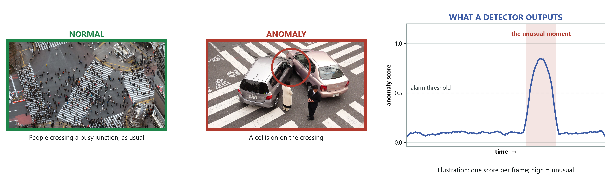

# DA-ZVAD — Presentation Script (20 minutes)

*Deck: DA-ZVAD_Phase3_Review.pptx · October 2026. Page numbers below are the
numbers printed in the corner of each slide, so they match what the panel sees.*

---

## How to use this script

Each slide has five parts:

- **Time** — how long to spend, and where you should be on the clock.
- **Say** — the words to speak, in the box. Short sentences. Learn the **bold
  line** in each box by heart; say the rest in your own words.
- **Point at** — where your hand goes on the screen.
- **If they ask** — the small-detail questions your professor is likely to ask
  about *that slide*, with a short answer.
- **→ Next** — one sentence that carries you into the next slide.

Three rules for tomorrow:

1. **Say every number exactly as it is on the slide.** If you round 0.734 to
   "about 0.73" on one slide and the table says 0.734, a picky reader notices.
2. **When a slide shows a weakness, say it before they ask.** It sounds
   confident, not defensive.
3. **If you do not know, say:** *"I haven't measured that yet — here is the
   experiment that would answer it."* Never guess a number.

---

## The clock

| Page | Slide | Time | Clock at end |
|---|---|---|---|
| — | Title | 20 s | 0:20 |
| 1 | What is video anomaly detection? | 35 s | 0:55 |
| 2 | The problem | 45 s | 1:40 |
| 3 | Research gap 1 | 50 s | 2:30 |
| 4 | Research gap 2 | 40 s | 3:10 |
| 5 | The framework diagram | 2 min | 5:10 |
| 6 | Why everything is frozen | 40 s | 5:50 |
| 7 | The protocol | 40 s | 6:30 |
| 8 | What we ran | 25 s | 6:55 |
| 9 | What the data looks like | 20 s | 7:15 |
| 10 | The first result failed | 30 s | 7:45 |
| 11 | Diagnosis 1 | 45 s | 8:30 |
| 12 | The evidence | 20 s | 8:50 |
| 13 | Diagnosis 2 | 50 s | 9:40 |
| 14 | After the fix | 45 s | 10:25 |
| 15 | Same, drawn | 15 s | 10:40 |
| 16 | One clip | 20 s | 11:00 |
| 17 | Stating the claim precisely | 50 s | 11:50 |
| 18 | Components | 30 s | 12:20 |
| 19 | Window chart | 15 s | 12:35 |
| 20 | Second dataset (Avenue) | 45 s | 13:20 |
| 21 | Testing the explanation | 40 s | 14:00 |
| 22 | Every camera view | 15 s | 14:15 |
| 23 | A sentence per camera | 45 s | 15:00 |
| 24 | UCF-Crime predictions | 60 s | 16:00 |
| 25 | UCF-Crime drawn | 20 s | 16:20 |
| 26 | Six things that failed | 25 s | 16:45 |
| 27 | Against the literature | 50 s | 17:35 |
| 28 | Limitations | 35 s | 18:10 |
| 29 | What comes next | 25 s | 18:35 |
| 30 | Summary | 30 s | 19:05 |
| 31–33 | References | skip | — |

That leaves **about 1 minute spare** for interruptions. If you are behind at
the **10:30 mark** (you should be on page 15), use the cut list at the end.

---

# Part 1 — The problem (pages Title–4)

## Title · 20 s · *clock 0:20*

**On screen:** title, your name, supervisors, one line about the idea.

> **Say:** "This is my Phase 3 progress. **I adapt a video anomaly detector to
> a new camera with one sentence — and the system writes that sentence
> itself.** Nothing is trained and every model stays frozen. I'll show you what
> worked, and also a prediction of mine that failed."

**If they ask:**
- *"Phase 3 — what was Phase 2?"* — Phase 2 built the method and the main
  ShanghaiTech experiments. Phase 3 added per-camera sentences, automatic
  sentence writing, and a third dataset, UCF-Crime.

**→ Next:** "First, the basic idea: what anomaly detection is."

## Page 1 — What is video anomaly detection? · 35 s · *clock 0:55*

**On screen:** three pictures — a busy crossing (normal), a collision on a
crossing (anomaly, circled), and a drawing of a detector's score over time;
three boxes underneath: What, How, Why it is hard.

> **Say:** "Before the research, the basic idea. **Video anomaly detection means
> finding moments that don't fit what usually happens at that place.** On the
> left, a busy crossing — hundreds of people, all normal. In the middle, a
> collision on a crossing. That's an anomaly. On the right is what a detector
> produces: **a score for every frame.** It stays low, then rises at the unusual
> moment and crosses the alarm line."

> "Why is it hard? **Anomalies are rare and varied, so nobody can collect
> examples of all of them.** So systems learn what 'normal' looks like instead,
> and flag anything that doesn't fit."

**Point at:** the busy crossing → the red circle → the peak in the curve.

**If they ask:**
- *"Are these from your dataset?"* — No. These two are public photos from
  Wikimedia Commons, used to explain the idea; the credit is at the bottom of
  the slide. My own data starts on page 9.
- *"Is the score curve real?"* — No, it's an illustration of what a detector
  outputs; the slide labels it. Real score curves from my system are on
  page 16.
- *"Why is the alarm line there?"* — It's for illustration. My results use
  AUROC, which needs no threshold.
- *"How do you measure success?"* — AUROC: pick one anomalous frame and one
  normal frame at random; how often does the anomalous one score higher? 0.5 is
  guessing, 1.0 is perfect.

**→ Next:** "Today, building one of these ties it to a single place. That's the
problem."

## Page 2 — A detector is tied to the place it learned · 45 s · *clock 1:40*

**On screen:** the mall vs factory example — the same forklift, opposite answers.

> **Say:** "Today, a detector learns what 'normal' looks like from weeks of
> footage at one camera. Move it, and it fails — you collect new footage and
> retrain. Look at this example: a forklift in a shopping mall is an alarm. The
> same forklift on a factory floor is routine. **Same picture, opposite answer.
> The picture didn't change — the rule did.**"

**Point at:** the two boxes, mall then factory.

**If they ask:**
- *"Is the forklift example from your data?"* — No, it's an illustration. The
  real example from my data is on page 4: a vehicle on a walkway is an anomaly
  in ShanghaiTech.

**→ Next:** "This kind of difference has a name in the literature."

## Page 3 — The literature solves the adjacent problem · 50 s · *clock 2:30*

**On screen:** covariate shift vs concept shift table; the Liu quotation.

> **Say:** "Domain adaptation research splits differences between places into
> kinds. **Covariate shift: the appearance changes** — a stop sign in fog. Still
> a stop sign. **Concept shift: the rule changes** — a bicycle on a road versus
> a footpath. Same image, opposite label. The surveys say openly that they focus
> on covariate shift. That's fair for recognising objects — a cat is a cat
> everywhere. But anomaly detection is built on concept shift."

**Point at:** the two table rows, then the quotation.

**If they ask:**
- *"Which paper is the quote from?"* — **Liu et al. 2022, reference [14]**, a
  survey of unsupervised domain adaptation.
- *"What does Singhal [15] say?"* — They list "covariate shift" — that p(y|x)
  stays the same across domains — as the first condition for domain adaptation
  to be justified. So the theory assumes concept shift away.
- *"What are references [11–15, 20]?"* — The six surveys: Patel 2015, Wang
  2018, Wilson 2020, Liu 2022, Singhal 2023 — and Kouw & Loog for the taxonomy.

**→ Next:** "Why that matters for anomaly detection specifically."

## Page 4 — Why that matters for anomaly detection · 40 s · *clock 3:10*

**On screen:** three examples (running, lying down, a vehicle) — normal in one
place, anomalous in another.

> **Say:** "**In anomaly detection, 'normal' is defined by the place, not the
> object.** A person running is normal in a park and suspicious in a bank vault.
> So methods that make two places *look* the same can't help — the look is
> already the same; only the rule differs. A 2026 paper [1] argues the same idea
> independently. What's missing is a *test* of whether giving the system
> context actually does anything."

**If they ask:**
- *"Did you invent this problem?"* — No, and I say so: Wilkinghoff et al. 2026
  [1] make the same argument. What I add is stating it in domain-adaptation
  terms, using a sentence instead of extra sensors, and a test.
- *"Is the vehicle example real?"* — Yes. Vehicles on the walkway are a real
  anomaly class in ShanghaiTech.

**→ Next:** "So here is the system I built to run that test."

---

# Part 2 — The method (pages 5–9)

## Page 5 — DA-ZVAD: one sentence per camera (the diagram) · 2 min · *clock 5:10*

**On screen:** the architecture diagram. Spend the most time here.

> **Say (the short version first):** "Video comes in at the top. **A sentence
> about the place comes in at the bottom — and the system writes that sentence
> itself.** They meet in the middle. Nothing is trained."

Then walk it, left to right — one breath per box:

> **SETUP · ONCE (bottom left):** "When a camera is installed, LLaVA looks at
> its first three frames and writes one sentence about the place — like 'a park
> with a sidewalk and a bench'. It keeps the caption the three frames agree on."

> **M1 · VISUAL SCORING (top):** "CLIP turns every frame into 768 numbers that
> describe what's in it."

> **M3 · VERBALISED CONTEXT (bottom middle):** "I keep two short lists of
> phrases — normal ones and abnormal ones. **The camera's sentence is added to
> the normal list only.** That one rule is the most important arrow in the
> diagram — page 13 shows what happens without it."

> **FRAME SCORING (middle):** "Each frame is compared with the 'normal' summary
> and the 'abnormal' summary. The score is how much more abnormal than normal it
> looks — between 0 and 1."

> **M2 · SMOOTHING:** "Scores jump around, so each frame is averaged with 15
> frames either side — about a second. One odd frame can't raise an alarm."

> **DETECTION · M4 (right):** "If the smoothed score crosses a threshold, the
> frame is flagged, and the same LLaVA can explain it in words."

**Point at:** the snowflakes ("nothing trains"), the orange "c_k enters P⁺
only", the SETUP box.

**If they ask (this slide gets the most detail questions):**
- *"What is λ ≈ 100?"* — CLIP's own temperature, learned when CLIP was trained.
  I don't choose it; it ships with the model. I measured it: exactly 100.
- *"What is τ? How did you choose it?"* — τ is the alarm threshold. **My results
  use AUROC, which needs no threshold**, so I never had to choose one. In a real
  deployment it would be set per site.
- *"Why w = 31?"* — From a sweep: performance rises up to 31 and falls after, so
  it's a real optimum (page 19).
- *"What does c_k mean?"* — The sentence for camera k. Each camera has its own.
- *"Is 'a park with a sidewalk and a bench' a real caption?"* — Yes, it's
  LLaVA's caption for camera 01 of ShanghaiTech.
- *"Why ViT-L/14 and LAION-2B?"* — A large public CLIP model trained on a big
  public dataset; it's the standard strong open checkpoint. Trying a second
  backbone is on my plan.
- *"Has M4 explained anything?"* — It runs on video now — it writes every camera
  sentence. Explaining flagged events is not done yet; it's on the limitations
  slide.
- *"Isn't CLIP trained? How is this training-free?"* — CLIP and LLaVA were
  trained by others on web data. I never train on anomaly data or on the target
  videos — no gradient step anywhere.

**→ Next:** "Freezing everything isn't about saving compute. It's what makes the
claim testable."

## Page 6 — Why freezing everything is the point · 40 s · *clock 5:50*

> **Say:** "If the system learned even a little from a new site and got better,
> I couldn't say whether the sentence helped or the learning did. So nothing is
> allowed to change. **Exactly one thing can vary: the text. So any difference
> is caused by the text.** And competing systems can't run this test — their
> text is learned on training data, or mixed into a language model, or paired
> with trained parts."

**If they ask:**
- *"Which systems are [8], [7] and [10]?"* — **[8] VERA** learns its questions
  on training data. **[7] LAVAD** puts the judgement inside a large language
  model. **[10] OVVAD** trains detection heads on top of CLIP.

**→ Next:** "And a testable claim needs a way to be proven wrong."

## Page 7 — A protocol that can prove us wrong · 40 s · *clock 6:30*

**On screen:** the four conditions table.

> **Say:** "I run the identical pipeline four times and change only the
> sentence. None. A meaningless one — 'a generic scene'. The correct one. And a
> deliberately wrong one — a factory description on campus video. **That last
> one is the test that could prove me wrong: if a wrong sentence costs nothing,
> the system isn't using the sentence.** I wrote down what each outcome would
> mean before running anything."

**If they ask:**
- *"What exactly are the sentences?"* — Matched (ShanghaiTech): **"a university
  campus walkway with pedestrians"**. Mismatched: **"an industrial
  quality-inspection image of a manufactured product on a factory line"**.
  Generic: **"a generic scene"**.

**→ Next:** "Here is what it ran on."

## Page 8 — What we ran · 25 s · *clock 6:55*

**On screen:** the setup table.

> **Say:** "**Three video benchmarks:** ShanghaiTech with 12 camera views,
> Avenue with one, and UCF-Crime with about 290 different places. MVTec is an
> image dataset I use only as a baseline. In total, **418 test videos and
> 97,752 frames.** CLIP and LLaVA, both frozen, on the college A40. Every run
> writes a record of the exact code version and settings."

**If they ask (numbers on this slide):**
- *"How do you get 418?"* — 107 ShanghaiTech + 21 Avenue + 290 UCF-Crime test
  videos.
- *"How do you get 97,752 frames?"* — Frames actually scored: 20,449
  (ShanghaiTech, every 2nd frame) + 7,669 (Avenue, every 2nd frame) + 69,634
  (UCF-Crime, every 16th frame).
- *"Why every 16th frame on UCF-Crime?"* — UCF-Crime is about a million frames;
  16-frame steps are the standard unit there. LAVAD samples every 16th frame
  too.
- *"What is in a manifest?"* — Code commit, whether the code was clean, GPU and
  library versions, full settings, frame and label counts. I can open one.

**→ Next:** "Thirty seconds on what the data looks like."

## Page 9 — What the two campus benchmarks look like · 20 s · *clock 7:15*

**On screen:** grid of normal and anomalous frames, one camera per column.

> **Say:** "**Each column is one fixed camera — only the event changes.** An
> empty walkway and the same walkway with a cyclist look almost the same to a
> computer, and they're labelled opposite. UCF-Crime is the other extreme:
> almost every video is a different place."

**If they ask:**
- *"Why no UCF-Crime frames here?"* — This figure is about one fixed camera,
  which UCF-Crime doesn't have; its results are on pages 24–25.

**→ Next:** "Now what happened. The first result was a failure."

---

# Part 3 — Failure and diagnosis (pages 10–13)

## Page 10 — The first result was a failure · 30 s · *clock 7:45*

**On screen:** 0.49, and the backwards table.

> **Say:** "The first full run scored **0.49 — exactly a coin flip.** And the
> main experiment came out backwards: the correct description did *worst*,
> 0.666, and the wrong one did among the best, 0.695. **This is where the idea
> looks broken.**" *(pause two seconds)*

**If they ask:**
- *"Why is the overall score 0.49 but the table shows 0.666?"* — 0.49 is the
  first overall number, computed the wrong way (next slide). The table shows
  the same experiment after that fix — and it was *still* backwards. That's why
  there were two separate problems.

**→ Next:** "There were two problems. The first was in how I measured."

## Page 11 — Diagnosis 1: we were measuring it wrong · 45 s · *clock 8:30*

**On screen:** the 12 cameras, the error, the schools analogy, 0.49 → 0.67.

> **Say:** "ShanghaiTech has 12 cameras, and CLIP gives each camera a different
> baseline score — different light, different angle. I put all frames from all
> 12 cameras into one ranking. **It's like ranking students from different
> schools by raw marks when the schools mark differently.** The benchmark's own
> protocol scales each clip first. I wasn't doing that. With identical scores,
> fixing it takes **0.49 to 0.67** — and with smoothing, **0.52 to 0.71**."

**If they ask:**
- *"Do you use labels to fix it?"* — No. Each clip's scores are scaled to 0–1
  using only the scores themselves.
- *"Isn't that cheating?"* — It's the published protocol for this benchmark —
  Liu et al. 2018 [21] do exactly this. Both numbers are in my paper.
- *"Why two pairs of numbers?"* — 0.49 → 0.67 is without smoothing, 0.52 → 0.71
  is with the 31-frame smoothing. Each pair uses identical scores.

**→ Next:** "That's a strong claim about my own bug, so here's the evidence."

## Page 12 — The evidence for that diagnosis · 20 s · *clock 8:50*

**On screen:** two panels — frames coloured by camera; similarity per camera.

> **Say:** "Left: every frame, coloured by camera — **the cameras sit in
> separate clumps.** Right: each camera sits at its own level, more than 0.13
> apart. **Neither panel uses labels**, so this isn't hindsight."

**If they ask:**
- *"What is the left plot?"* — t-SNE: a way to flatten the 768 numbers per
  frame to 2-D so we can see them.

**→ Next:** "That fixed the number but not the backwards result. That was a
second problem — the interesting one."

## Page 13 — Diagnosis 2: the description cancelled itself out · 50 s · *clock 9:40*

**On screen:** the normal prompt and the abnormal prompt, both containing the
same scene sentence.

> **Say:** "I was adding the scene sentence to **both** lists — normal and
> abnormal. Each list is averaged into one summary. Shared words pulled the two
> summaries toward each other — and the method depends on them being different.
> **The punchline: an accurate sentence matches every frame strongly, so it does
> the most damage.** A wrong one matches nothing, so it's harmless. That's why
> the result was backwards. The fix: add the sentence to the normal list only."

**Point at:** the shared words "a university campus walkway with pedestrians"
in both boxes.

**If they ask:**
- *"Are those the exact prompts?"* — Yes, those are two of the sentences the
  code builds. Each list actually gets two added sentences; the slide shows one
  from each.
- *"Did you measure 'pulled toward each other'?"* — Yes. The angle between the
  two summaries shrinks from 35.7° to about 25–26° when the sentence goes in
  both. And in Phase 3 I measured the direction: the accurate sentence drags
  both summaries onto the video itself (+0.067), the wrong one pulls them away
  (−0.017).

**→ Next:** "So I re-ran everything with that one change."

---

# Part 4 — The central result (pages 14–19)

## Page 14 — After the fix: the predicted signature · 45 s · *clock 10:25*

**On screen:** the two-row table; 0.734 and 0.628.

> **Say:** "Same models, same video. Only the sentence and where it goes
> change. **Look at the 'none' column first — 0.707 in both rows.** It must be
> identical, because with no sentence there's nothing to place. That's my
> control. Now the bottom row: the correct sentence 0.734, the wrong one
> **0.628 — a 10-point drop.** Nothing else could change, so the text caused
> it. *How* it caused it is page 17."

**If they ask:**
- *"Which setting are these numbers?"* — ShanghaiTech, all 107 clips, window
  31, each clip scaled to 0–1, then pooled.
- *"What is 'gap'?"* — Correct sentence minus wrong sentence: +0.105 in the
  bottom row, −0.029 in the top row.

**→ Next:** "Same numbers, drawn."

## Page 15 — The same experiment, drawn · 15 s · *clock 10:40*

> **Say:** "**The number that matters is the arrow** — the distance between
> correct and wrong. Grey, sentence in both lists: −0.029. Orange, normal list
> only: +0.105. Only the placement changed."

**→ Next:** "Here it is on a single clip."

## Page 16 — One clip, two sentences · 20 s · *clock 11:00*

> **Say:** "One clip, same frozen models, same frames. Only the sentence
> differs — campus or factory. **The two lines match outside the event and
> separate inside it.**"

**If they ask:**
- *"Which clip?"* — ShanghaiTech clip 04_0004. It's one example; the averages are
  on pages 14–15.

**→ Next:** "Now let me be precise about what this does and doesn't show."

## Page 17 — Stating the claim precisely · 50 s · *clock 11:50*

**This is the slide your professor is most likely to push on. Go slowly.**

> **Say:** "Two halves. **The weaker half:** the correct sentence beats no
> sentence by only +0.027 — inside the ±0.036 wobble between data splits. So I
> report the direction, not the size. **The claim I make:** a wrong sentence
> lowers the benchmark score by 0.105, and nothing else could cause that.

> **Then something I found myself in Phase 3:** if you judge only which frames
> rank highest *inside each video*, the gap is just **+0.006**. So **the
> sentence mostly shifts each video's overall score level — it tells cameras
> apart — and the pooled score rewards that. It barely changes which moments
> inside a video look abnormal.** I'm auditing this properly next."

**If they ask:**
- *"So is your main result wrong?"* — The number is right — it's what the
  standard metric gives. The *explanation* changes: the sentence works mainly by
  putting different cameras on a common scale, not by changing what counts as
  normal inside a video. That fits all my results — no effect on one-camera
  Avenue, a shrinking gap inside one view, and per-camera sentences helping.
- *"Why +0.006 at w=5 and not w=31?"* — My records of the within-video metric
  are at w=5; at that same setting the pooled gap is +0.100. Re-measuring at
  w=31 is the first step of the audit. I also have a second check at w=31: using
  the raw similarity instead of CLIP's softmax, the pooled gap is +0.017.
- *"What is the ±0.036?"* — The spread of results when I split the clips into
  different halves five times (page 18).

**→ Next:** "Next question: does every part of the system earn its place?"

## Page 18 — Which components earn their place · 30 s · *clock 12:20*

> **Say:** "I tried other ways to score frames — by motion, by distance from the
> clip's own average, and combinations. **Language alone is best.** And one
> surprise: I expected motion to help — a bicycle at cycling speed — and it
> added nothing."

**If they ask:**
- *"What does held-out mean?"* — I split clips into two halves five different
  ways, chose settings on one half, and report the other half. ± is the spread.
- *"Why is the full-set number 0.707 but held-out 0.718?"* — Different subsets
  of clips; the held-out figure is an average over five halves.

**→ Next:** "Two of these are easier to see as charts."

## Page 19 — Window length, and what each component adds · 15 s · *clock 12:35*

> **Say:** "Left: smoothing helps up to 31 frames, then hurts — **a real best
> setting**, not just more blur. Right: the error bars overlap, so I say
> *nothing beat language alone* — not that language wins."

**→ Next:** "Everything so far is one dataset. The real test is a second one."

---

# Part 5 — Other datasets and Phase 3 (pages 20–26)

## Page 20 — A second domain: the replication test · 45 s · *clock 13:20*

**On screen:** ShanghaiTech vs Avenue table.

> **Say:** "Same system, nothing retuned, applied to Avenue. **Detection
> transfers: 0.706 against 0.707 with no sentence.** But the sentence effect
> nearly vanishes: the gap drops from +0.105 to +0.020, and the correct sentence
> scores *below* none. My explanation: ShanghaiTech has 12 cameras, Avenue has
> one — **a scene sentence only has work to do when there are several places to
> tell apart.**"

**If they ask:**
- *"Why does 'generic' do best on Avenue (0.729)?"* — An extra prompt helps
  just by making the normal list bigger, whatever it says. That's not
  adaptation, and I don't claim it is.
- *"Gap 5× smaller?"* — 0.105 ÷ 0.020 ≈ 5.

**→ Next:** "That's a convenient explanation, so I tested it."

## Page 21 — We tested that explanation, and it held · 40 s · *clock 14:00*

**On screen:** gap vs number of scenes, four rows.

> **Say:** "ShanghaiTech is really 12 one-camera datasets stacked together. If
> the sentence works by telling cameras apart, then **inside a single camera the
> effect should almost disappear** — and it did: +0.033, next to Avenue's
> +0.020. Then in Phase 3, UCF-Crime with about 290 places: **+0.096 — no bigger
> than 12 cameras.** So the effect *needs* several scenes, but it doesn't keep
> growing."

**If they ask:**
- *"The UCF row says 'raw, w=5' — is it comparable?"* — Not exactly: UCF-Crime
  uses raw scores and window 5, as I registered in advance; the ShanghaiTech
  rows use scaled scores and window 31. That's why the row says so.
- *"Is +0.033 significant?"* — It's clearly *smaller* than +0.105 — no
  resample of the nine views reached 0.105. But it's not clearly above zero; its
  95% range is −0.005 to +0.070.
- *"Why 9 views, not 12?"* — Three views have too few clips, or only one kind
  of frame, to score.

**→ Next:** "Here are those nine views one by one."

## Page 22 — Every camera view, one at a time · 15 s · *clock 14:15*

> **Say:** "Each bar is one camera. **Most are well below the pooled line, three
> are negative**, and views 03 and 07 nearly reach it. It's a shift in the
> average, not a clean collapse."

**If they ask:**
- *"Which three are negative?"* — Views 04, 08 and 10.

**→ Next:** "If the sentence tells cameras apart, twelve cameras shouldn't share
one sentence. That's where Phase 3 starts."

## Page 23 — A sentence per camera, written by the system · 45 s · *clock 15:00*

**On screen:** per-camera chart.

> **Say:** "Each camera gets its own sentence. **Written by hand: 0.749. Written
> by LLaVA from the camera's first three frames, with no person and no labels:
> 0.751.** The control: give each camera *another* camera's sentence — every
> one is a believable campus description — and it drops. **Even the best of 11
> swaps, 0.737, loses.** So the benefit comes from the sentence matching its
> camera."

**If they ask:**
- *"Does LLaVA beat a human?"* — No. 0.751 vs 0.749 is noise. It *matches*.
- *"Is 0.751 vs 0.734 a real improvement?"* — It's inside the ±0.036 wobble,
  so I report the direction only. The solid comparison is against the swaps.
- *"Did LLaVA see the answers?"* — My first run picked frames using the labels;
  I caught that and reran it picking the first three frames blind. It moved by
  0.004 (0.755 → 0.751). 0.751 is the label-free number.
- *"0.737 is for hand-written swaps — what about LLaVA's?"* — LLaVA's best swap
  is 0.722, also below.

**→ Next:** "That's twelve campus cameras. The real test is somewhere new — so I
wrote my predictions down first."

## Page 24 — UCF-Crime: predictions written down first · 60 s · *clock 16:00*

**On screen:** 0.824 and the four-prediction table.

> **Say:** "UCF-Crime: **290 real CCTV videos from about 290 places, 140 with a
> crime.** Before computing any score, I committed four predictions to git — the
> timestamp proves they came first. **Result: 0.824 with no training.** LAVAD
> reports 0.803, AnyAnomaly 0.807. **P1 failed:** I predicted the effect would
> grow with more scenes; it didn't. So I narrowed my claim from 'scales with
> scene diversity' to 'needs it'. The strongest line is P2: a video's own
> sentence beats other videos' sentences by 0.110."

**If they ask:**
- *"Did you beat LAVAD?"* — Comparable or better. Same benchmark, and LAVAD also
  samples every 16th frame, but these are numbers from different papers.
- *"How does CLIP alone reach 0.824?"* — Not alone: LLaVA writes each video's
  sentence from its first three sampled frames, and that conditions CLIP. With
  no sentence it's 0.756.
- *"Which metric?"* — Raw scores pooled across all videos, window 5 — the
  standard UCF-Crime metric. I fixed that choice in advance.
- *"What if you scale each video like ShanghaiTech?"* — Lower: 0.789, and the
  sentence effect shrinks a lot. I say so on the limitations slide.
- *"Did any first frames already show the crime?"* — In 3 of the 140 crime
  videos, yes. I kept them, because removing them would need the labels.
- *"What are the 13 crime classes?"* — Abuse, arrest, arson, assault, burglary,
  explosion, fighting, road accidents, robbery, shooting, shoplifting, stealing,
  vandalism.

**→ Next:** "Here is the picture — one bar in it is the most convincing thing in
Phase 3."

## Page 25 — UCF-Crime, drawn · 20 s · *clock 16:20*

> **Say:** "**Look at the bottom bar: another video's sentence scores 0.713 —
> below having no sentence at all, 0.756.** A description of the wrong place
> misleads the model. The dashed line is LAVAD's 0.803 — another paper's
> number, so I read it as comparable."

**If they ask:**
- *"Why does the axis start at 0.68?"* — To make the differences readable; the
  caption says so. The bars are not lengths from zero.

**→ Next:** "Before the comparison, everything I tried that didn't work."

## Page 26 — Six things that did not work · 25 s · *clock 16:45*

> **Say:** "My claim is that the simplest version is the right one. That's only
> believable next to what I tried. **Six attempts, none helped.** For example,
> prompts naming bicycles and vehicles made it much *worse* — 0.486 — because
> the shared words caused the same cancelling problem as page 13."

**If they ask:**
- *"Why did quadrant scoring fail?"* — Averaging quarters beat taking the
  maximum, which is the opposite of what finding a small object looks like. So
  splitting into four wasn't fine enough; patch-level scoring is next.

**→ Next:** "Where does this leave the work against other methods?"

---

# Part 6 — Assessment and close (pages 27–30)

## Page 27 — Where this sits against the literature · 50 s · *clock 17:35*

**On screen:** training-free methods on Avenue, ShanghaiTech and UCF-Crime.

> **Say:** "These are training-free methods. **On UCF-Crime, the most diverse
> benchmark, mine is first of six: 82.4, above LAVAD's 80.3 and AnyAnomaly's
> 80.7.** On the two campus benchmarks, AnyAnomaly is ahead. But there's a
> difference: **AnyAnomaly asks 'is the thing I named happening?' — and in its
> evaluation it's given the benchmark's list of anomaly types. I ask 'is
> anything happening that doesn't belong here?' — I'm told nothing about the
> anomalies.**"

**Point at:** the UCF column, then the AnyAnomaly row.

**If they ask:**
- *"What does ‡ mean?"* — Those UCF-Crime numbers come from LAVAD's paper,
  Table 1. All other numbers come from AnyAnomaly's paper, Tables 5–6. I checked
  each one in the original PDF.
- *"Why is your Avenue number 67.7 here but 0.706 on page 20?"* — Here I use the
  same setting on both datasets — the correct shared sentence. 0.706 is 'no
  sentence'. Picking the best setting per dataset would flatter the table.
- *"Why does UCF use a different setting from Avenue/ShT?"* — The footnote says
  so: on UCF each video has its own sentence, as registered in advance.
- *"Why is Avenue weak?"* — One camera, so the sentence has nothing to tell
  apart; and its anomalies include 'too close' and throwing, which are about
  distance and motion, not about what's in the frame.
- *"Video-ChatGPT and LLaVA are bigger models — why do they score lower?"* —
  They're chat models asked to give a number; they're not built to rank frames,
  which is what AUROC measures.

**→ Next:** "In the same spirit, the limitations — stated by me."

## Page 28 — Limitations we are stating ourselves · 35 s · *clock 18:10*

> **Say:** "Six limitations, briefly. **It only works where there are several
> scenes.** It can't see very small objects in a whole-frame summary. **I
> haven't settled what the sentence actually does — inside a video it barely
> re-ranks frames.** The standard metrics can change without the ranking
> changing — that affects the whole field, not just me. There's no validation
> split for these benchmarks. And M4 doesn't explain events yet."

**If they ask:**
- *"What do you mean, the metric changes without the ranking changing?"* — Two
  scores that rank frames identically can give different pooled AUROC after each
  clip is scaled to 0–1. I measured up to 0.05 from this alone.

**→ Next:** "Each limitation maps to a next step."

## Page 29 — What comes next · 25 s · *clock 18:35*

> **Say:** "**First, a measurement audit** — it decides what the sentence really
> does. Then XD-Violence, LAVAD's second benchmark. Then **NWPU Campus — the
> only dataset where the same event is normal in one scene and abnormal in
> another**: a direct test of concept shift. Then patch-level scoring and the
> explanations."

**If they ask:**
- *"What's in the 'Done since Phase 2' box?"* — The within-view check with a
  confidence range, the direction measurement, per-camera sentences by LLaVA,
  UCF-Crime with pre-registered predictions, and every citation checked against
  its source paper.

**→ Next:** "To summarise."

## Page 30 — Summary · 30 s · *clock 19:05*

**Say — one line each, then stop:**

1. "The field studies covariate shift; anomaly detection is concept shift."
2. "Every model is frozen; one sentence per camera, written by the system."
3. "**0.751 on ShanghaiTech and 0.824 on UCF-Crime with no training.** A wrong
   sentence costs 0.105 — mostly by shifting scores between videos."
4. "Where the sentence goes matters more than what it says."
5. "It needs several scenes — and when I predicted it would keep growing, the
   test said no."

> "Thank you."

**Do not:** add a long thank-you, or start explaining again. Stop and wait for
questions.

## Pages 31–33 — References

Skip. If asked: *"Which survey has the concept-shift quote?"* — **Liu et al.
2022, reference [14].**

---

# Appendix A — Every number on the slides

| Number | What it is | Setting |
|---|---|---|
| 0.49 | First overall result (wrong pooling) | ShT, no smoothing |
| 0.67 / 0.71 | Same scores, correct pooling | ShT, w=1 / w=31 |
| 0.52 | Raw pooling with smoothing | ShT, w=31 |
| 0.707 | No sentence | ShT, w=31, scaled per clip |
| 0.734 | Correct shared sentence | ShT, w=31, scaled per clip |
| 0.628 | Wrong (factory) sentence | ShT, w=31, scaled per clip |
| +0.105 | Correct − wrong | ShT, w=31 |
| −0.029 | Same gap, sentence in both lists | ShT, w=31 |
| +0.027 | Correct − none | ShT, w=31 (inside ±0.036) |
| +0.006 | Correct − wrong, *within each video* | ShT, w=5 (pooled at w=5: +0.100) |
| 0.706 / 0.020 | Avenue: none / gap | Avenue, w=31 |
| +0.033 | Gap inside one camera (mean of 9) | ShT, w=31 |
| 0.749 / 0.751 | Per-camera sentence: hand / LLaVA | ShT, w=31 |
| 0.737 / 0.722 | Best swapped arrangement: hand / LLaVA | ShT, w=31 |
| 0.824 | UCF-Crime, own LLaVA sentence per video | raw pooled, w=5 |
| 0.756 / 0.713 | UCF-Crime: none / other videos' sentences | raw pooled, w=5 |
| +0.096 | UCF-Crime own sentence − wrong domain | raw pooled, w=5 |
| 82.4 / 80.3 / 80.7 | Ours / LAVAD / AnyAnomaly on UCF-Crime | papers' own metrics |
| 73.4 / 67.7 | Ours on ShT / Avenue in the comparison | shared correct sentence |
| 88.5% | MVTec image AUROC (baseline only) | images |

# Appendix B — If you run out of time

Cut in this order (move through the slide in one sentence, don't skip it):

1. Page 15 (drawn version of 14) — say "same numbers, as bars".
2. Page 19 (window chart).
3. Page 22 (per-view bars) — say "three of nine are negative" on page 21.
4. Page 25 (UCF chart) — say "another video's sentence is worse than none" on 24.
5. Page 12 (evidence) — keep only if asked.
6. Page 5: shorten to the one-line version plus the SETUP box and the "normal
   only" arrow.

**Never cut:** pages 1, 5, 7, 13, 14, 17, 20, 23, 24, 27.

# Appendix C — Five lines to know cold

1. "A detector is stuck in the place it learned; I move it with one sentence the
   system writes itself."
2. "Domain adaptation handles 'things look different'; anomaly detection is
   'the same thing means something different'."
3. "0.824 on UCF-Crime with no training — comparable to or above the best
   training-free methods."
4. "Where the sentence goes matters more than what it says."
5. "It works by telling cameras apart — it needs several scenes, and I measured
   that rather than assuming it."

# Appendix D — Never say

- "I beat LAVAD." → say "comparable or better".
- "The sentence redefines what's normal." → say "the sentence tells the model
  which scene it's in".
- "LLaVA writes better sentences than a human." → say "it matches".
- "0.751 is better than 0.734." → say "same direction, inside the noise".
- Any number you're not sure of. → "I'd have to check — here's how I'd measure it."
