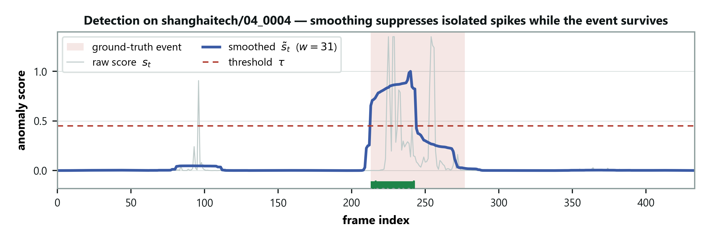
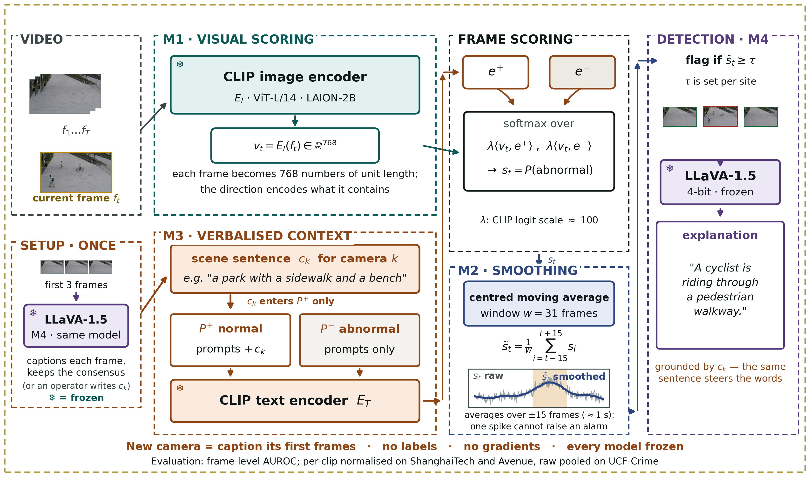

# DA-ZVAD — Project Handbook

*A document to learn from. Written to be read straight through.
Last updated 25 August 2026: eight figures added, each with an explanation of
how to read it and what to say about it.*

---

## How to read this

This is written to **teach**, not to look things up in. Each idea is built before
it's used, so reading in order costs less effort than jumping around.

| Part | What it gives you |
|---|---|
| 1 | The idea, in ordinary words |
| 2 | The machinery — how a computer compares a picture to a sentence |
| 3 | The research question, and why it's a real gap |
| 4 | What we actually built |
| 5 | What happened when we ran it — the story, with the reasoning shown |
| 6 | Every result, explained |
| 7 | Is it any good? An honest answer |
| 8 | Answering questions |
| 9 | What's left, and where everything lives |
| 10 | Glossary and a self-quiz |

**The figures are part of the teaching, not decoration.** Eight of them are
spread through Parts 2, 4, 5 and 6, and each is followed by a section explaining
what to look at, in what order, and what a supervisor is likely to ask about it.
Figure 2 (the architecture, §4.1) and Figure 7 (the two curves, §6.3) are the two
you should be able to talk through from memory.

**If you only have twenty minutes:** Part 1, then §6.9, then the self-quiz.

The one companion document worth keeping is
`03_domain_adaptation_deep_dive.md` — the detailed study of the six survey papers
your supervisor assigned. Everything else has been folded in here.

---

---

# Part 1 — The idea

## 1.1 What the system does

It watches CCTV video and flags moments that look unusual — someone cycling
through a pedestrian area, a car where cars shouldn't be, people running.

That's not new. What's new is **how you move it to a new location.**

## 1.2 Why moving it is the hard part

Almost every anomaly detector works like this: show it many hours of *ordinary*
footage from one camera. It gradually builds a picture of what ordinary looks
like there. Anything that doesn't fit gets flagged.

This works, and it has a problem.

**The system's idea of "normal" belongs to that one camera.** Move it to a
different building, a different angle, a different kind of place, and it breaks.
Not slightly — completely.

Take a concrete case. A detector installed in a shopping mall learns that people
drift slowly, that shutters come down at 9pm, that the floor is empty at 3am.
Now install the same system in a warehouse. A forklift moving down an aisle is
completely routine there, and would have been an emergency in the mall.

**The footage is the same. The correct answer is the opposite.**

So the vendor collects fresh footage from the new site, waits, retrains, and
redeploys. For every customer. That is the cost we set out to remove.

## 1.3 Our idea, in one sentence

> **Don't retrain the system. Tell it, in English, where it is.**

You write one sentence — *"a university campus walkway with pedestrians"* — and
the system uses that sentence to work out what counts as normal there.

Nothing inside the system ever changes. No training, at any point, ever.

## 1.4 Why that could possibly work

This only makes sense because of a specific development of the last few years:
models that understand pictures *and* words together.

The one we use is called **CLIP**. It was shown roughly 400 million pictures from
the internet, each with its caption. It was never taught about anomalies,
campuses or bicycles specifically. It learned a general association between what
things look like and what people call them.

Because of that, you can hand CLIP a photograph and a sentence, and it will tell
you how well they match. That single ability is what the whole project is built
on. Part 2 explains how.

## 1.5 Why this counts as research, not just engineering

There's a whole research field about moving models between places. It's called
**domain adaptation**, and your supervisor gave you six survey papers about it.

Here's what makes this a thesis rather than a project:

> **That field almost entirely solves a different problem from ours.**

It handles cases where the same things *look* different — a stop sign in fog
versus sunshine. It largely sets aside cases where the same thing *means*
something different — a bicycle on a road versus on a footpath.

But that second case is the whole of anomaly detection. Part 3 develops this
properly, and it is the foundation of your argument.

---

---

# Part 2 — The machinery

*How the system works inside. If you're comfortable with embeddings, CLIP and
AUROC you can skim — but read §2.6, because every number in Part 6 is expressed
in it.*

## 2.1 What it means for a model to "know" something

A neural network is, in the end, a very large pile of numbers — millions of them.
Those numbers are called **parameters** or **weights**.

**Training** is adjusting those numbers so the model does something useful. It's
slow and needs a lot of data.

**Inference** is using the model afterwards, without changing anything.

> **Our system only ever does inference.** Not one parameter is ever adjusted.
> This is the most important fact about the design, and §4.4 explains why it
> isn't laziness.

## 2.2 Embeddings — turning things into lists of numbers

Feed a picture into a model and it produces a list of numbers. In our case, 768
of them. That list is called an **embedding**.

The list isn't arbitrary. It's arranged so that **similar things produce similar
lists**. Two photos of dogs give lists close together. A photo of a dog and a
photo of a bridge give lists far apart.

Picture each list as an arrow pointing somewhere. Similar things point in similar
directions.

### Measuring "similar direction"

To ask how closely two arrows point the same way, we use **cosine similarity**.
One number:

- **+1** — pointing exactly the same way
- **0** — at right angles, unrelated
- **−1** — pointing exactly opposite

That's the only geometry you need. Everything else follows from it.

## 2.3 CLIP — pictures and sentences in the same space

Here's the part that makes the project possible.

CLIP has two halves. One turns **pictures** into lists of 768 numbers. The other
turns **sentences** into lists of 768 numbers. They were trained together, on
those 400 million image–caption pairs, so that **a picture and its caption end up
pointing in similar directions.**

A photo of a dog, and the words *"a photograph of a dog"*, land close together.

So you can compare a picture to a sentence directly: take the picture's arrow,
take the sentence's arrow, measure the angle between them. **That's the whole
trick.**

## 2.4 Turning that into an anomaly score

**Step 1 — write two sets of sentences.**

*Normal:*
- "a normal day with people behaving ordinarily"
- "a calm and safe public area"
- "nothing dangerous or abnormal is happening"

*Abnormal:*
- "a dangerous or violent event"
- "a fight, robbery or accident in progress"
- "an abnormal and unsafe situation"

**Step 2 — turn each set into a single arrow.** Encode every sentence, average
them, then adjust the result back to unit length. That gives one arrow for
"normal" and one for "abnormal".

These averaged arrows are called **prototypes**. Remember the word — the
project's central finding is about them.

**Step 3 — score each frame.** Encode it, then measure how closely it points to
each prototype. Two numbers.

**Step 4 — convert to a probability** using **softmax**, a standard function that
turns scores into probabilities adding to 1. What comes out is *the probability
this frame is abnormal* — a number from 0 to 1. That's our anomaly score.

Notice what didn't happen: **nothing was trained.** The sentences did the
classifying.

## 2.5 Smoothing over time

Single frames are noisy. Someone walks in front of the camera, a light flickers,
and one frame scores oddly for no meaningful reason.

So we average each frame's score with its neighbours. With a window of 31, each
frame's final score is the average of it and the 15 either side.

Real events last a second or more and survive the averaging. One-frame noise
doesn't. This costs nothing — there's no parameter to learn, only a choice of
window size. Ours is 31, and §6.2 shows why.



### What this picture is showing you

**Look at the faint jagged line first.** That is the raw score for each frame in
order. Notice that it spikes *outside* the shaded band, where nothing is
happening — sometimes reaching as high as it does inside the band. If you had to
choose a threshold on that line, you would raise a great many false alarms.

**Now the solid line.** The same numbers, averaged with their neighbours. The
isolated spikes have flattened, because one odd frame surrounded by thirty
ordinary ones barely moves an average. The event survived, because it lasts long
enough that most of its neighbours belong to the event too.

**That asymmetry is the whole justification for M2.** Noise is short and averages
away; events are long and do not. Worth saying aloud: this costs nothing at all.
No parameter is fitted here — only a choice of how wide to average.

## 2.6 AUROC — how we measure success

**Read this properly.** Every number in Part 6 is an AUROC.

### Why not just "accuracy"?

Anomalies are rare — maybe 5% of frames. A system that says "normal" to
everything is 95% accurate and completely useless. Accuracy can't tell the
difference.

### The measure we use

> Pick one anomalous frame and one normal frame at random. **AUROC is how often
> the system gives the anomalous one a higher suspicion score.**

That's it.

- **0.50** — right half the time. A coin flip. Useless.
- **0.734** — right about 73 times in 100. Ours.
- **1.00** — always right.

It's the standard measure because it doesn't depend on where you set your alarm
threshold. It measures whether the system **ranks** things correctly, which is
the underlying ability.

### Two ways of averaging, and why it matters

We have 107 separate clips. Two ways to get one number:

**Micro** — pour every frame from every clip into one pile and rank them together.

**Macro** — score each clip on its own, then average the 107 scores.

They usually agree. **When they disagree badly, something is wrong with how clips
compare to each other** — and in §5.3 you'll see that happen, and what it
revealed.

---

---

# Part 3 — The research question

## 3.1 Domain adaptation

A **domain** is a setting a model works in — a particular camera, building, or
kind of scene. **Domain adaptation** is the study of moving a model between them.

It's a mature field. Your supervisor gave you six surveys of it, which is a
signal: he wants you to know it properly, and a panel may test the vocabulary.

## 3.2 The four kinds of difference — the key idea

When two places differ, researchers distinguish *what* differs. There are four
possibilities, and getting them straight is essential.

| Name | What changes | Everyday example |
|---|---|---|
| **Covariate shift** | The inputs look different | Same street, foggy instead of sunny |
| Conditional shift | A category looks different | "Cars" look different in Japan and India |
| Label shift | The proportions change | A quiet site has fewer anomalies |
| **Concept shift** | **The rule itself changes** | **A bicycle: fine on a road, anomalous on a footpath** |

The first and last matter here.

**Covariate shift** — the picture changed, the answer didn't. A stop sign in fog
is still a stop sign.

**Concept shift** — the picture didn't change, the answer did. Same bicycle, same
appearance, opposite label, because the *place* is different.

## 3.3 The gap — and how to state it precisely

This is the argument your whole thesis rests on. Learn it in this order.

**Step one: the field says which one it handles.**

Liu et al. (2022), one of your six surveys, states it outright:

> *"[Concept shift] is, however, usually not a common problem in popular object
> classification or semantic segmentation tasks. As such, this review mainly
> focuses on the covariate shift alignment."*

Singhal et al. (2023) go further: they list a *stable* rule — the answer not
changing between places — as the **first condition** under which domain
adaptation is theoretically justified.

So the field's theory **assumes concept shift doesn't happen.**

**Step two: for their problems, that's reasonable.** In object recognition a cat
is a cat everywhere. The rule genuinely is stable. They aren't being careless.

**Step three: but anomaly detection is built on the thing they excluded.**
"Normal" is a property of *where you are*, not of the object. That isn't an edge
case — it's the definition of the task.

**Step four: so the field's main tool doesn't apply.** The dominant family of
methods works by making two places *look* more alike. But in our case the two
places can look **identical** and still disagree about the answer. Making them
look more alike achieves nothing at all.

> **In one sentence:** *The domain-adaptation literature excludes the kind of
> difference that anomaly detection is made of.*

## 3.4 An honest complication — and why it helps you

In April 2026 a paper appeared (Wilkinghoff et al.) making the same core
observation independently: that what counts as normal depends on context, and
that judging it against one fixed standard is a mistake.

**Your first instinct may be that this weakens your contribution. It doesn't.**

Their paper is a *position paper*. It argues the problem exists and lists open
challenges. It runs no experiments.

So:
- The problem is **independently recognised** — you didn't invent it to have
  something to solve. That's a real objection you can now pre-empt.
- What they leave open is whether supplied context actually *does* anything.
  **That's exactly what we measure.**

Cite it and say so. Being caught not knowing about a paper on your own premise
would be far worse than citing it confidently.

---

---

# Part 4 — What we built

## 4.1 The system, in four parts

**M1 — the looker.** Frozen CLIP. Scores each frame against the two prototypes,
as in §2.4.

**M2 — the smoother.** Averages scores over time, as in §2.5.

**M3 — the scene description.** *This is the research.* Your sentence about the
site gets mixed into the prompts, so "normal" means normal *here*.

**M4 — the explainer.** A second frozen model (LLaVA) writes a sentence saying
what looks wrong in a flagged frame. **We have never run this on video.** It's
Phase 3 work.



### How to read the diagram

Spend a minute on this one, because you will be asked to walk through it.

**There are two inputs, not one.** On the left, the video is one input and the
operator's typed sentence is the other. Almost every other system in this area
has only the first. The sentence being an *input* — something a person supplies
at the moment of deployment, rather than something learned beforehand — is the
whole idea of the project in one picture.

**The two branches stay separate until they meet.** The top branch (M1) turns
each frame into a list of numbers. The bottom branch (M3) turns the prompts, with
your sentence mixed in, into two lists of numbers: one standing for "normal" and
one for "abnormal". Neither branch knows anything about the other until they meet
at the scoring step. That is *why* the sentence can only influence the result
through those two prototype vectors, and through nothing else.

**Every model box carries a snowflake.** That mark means the weights are frozen —
nothing is trained, nothing is updated, not even slightly. Point at these if
someone asks what makes the experiment trustworthy. Because nothing else is
allowed to change, anything that *does* change must have been caused by the
sentence. §4.4 is the long form of that argument.

**The right-hand side turns a score into a decision.** Scores per frame, then M2
smooths them over time, then a threshold turns the smoothed curve into flagged
events, then M4 explains one frame per event. M4 is drawn lighter because we have
not run it on video yet — do not let the diagram imply otherwise.

**A question to expect:** *"where does the training happen?"* It doesn't, anywhere.
CLIP and LLaVA were trained by other people on general web data; we use them
exactly as they are. That is deliberate, not a shortcut, and §4.4 says why.

## 4.2 How M3 actually works

This matters, because the project's most interesting finding is about it.

Take the normal sentences from §2.4. Now add two more, built from your
description:

- *"a university campus walkway with pedestrians, everything is normal"*
- *"a university campus walkway with pedestrians, a usual and safe moment"*

Those go into the normal set. Then the set is averaged into a prototype as
before.

So the scene description changes **where the normal prototype points**. That's
the entire adaptation mechanism. One sentence, one arrow moved.

## 4.3 The obvious version, which turned out to be wrong

The natural thing — and what we did first — was to add the description to
**both** sets:

- normal: *"a campus walkway with pedestrians, everything is normal"*
- abnormal: *"a campus walkway with pedestrians, but something is wrong"*

That looks symmetric and sensible. §5.4 explains why it fails badly, and it's the
finding you'll be asked about most.

## 4.4 Why everything is frozen — the identifiability argument

**Take time with this. It's the strongest thing in your design.**

Suppose we let the system learn a little from each new place. We change the
sentence, we let it learn, performance improves.

**Now: what caused the improvement?**

You can't say. The sentence changed *and* the model changed. The two effects are
tangled and no amount of analysis separates them.

Now suppose nothing in the model can change. Ever. Then when you run the system
twice, changing only the sentence, and the results differ —

> **the sentence caused it. There is no other candidate.**

That property is called **identifiability**: you can point at the cause.

**And here's what makes it a contribution rather than a constraint:** none of the
competing systems could run our experiment.

- **VERA** learns its text from source data — text and training are tangled by design
- **LAVAD** buries its notion of anomaly inside a language model's prior
- **OVVAD** trains an adapter alongside

In every one, something other than the text is free to move. **Ours is the only
design where text is the sole variable — which is the precondition for measuring
whether text does anything at all.**

> The architecture exists to make the experiment possible.

## 4.5 The experiment that could prove us wrong

Most papers show their method working. We designed a test that could show ours
*failing*.

Run the identical system four times. Change **only the sentence**.

| Condition | Sentence given | What it's for |
|---|---|---|
| **none** | M3 switched off | The baseline |
| **generic** | "a generic scene" | Controls for merely *having* a sentence |
| **matched** | The correct description | The intended way to use it |
| **mismatched** | A description of an **industrial factory**, fed to campus footage | **The falsifying control** |

The last one is the important one. If describing the wrong place costs nothing,
the system is ignoring its sentence and our claim is dead.

**What we predicted, before running anything:**
matched ≥ generic ≥ none, with mismatched clearly **worse**.

Writing the prediction down first matters. It means the experiment could
genuinely fail — and the first time, it did.

---

---

# Part 5 — What happened

*Told in order, with the reasoning shown. This is the part to present.*

## 5.1 What we ran it on

| | |
|---|---|
| **ShanghaiTech** | Campus CCTV, **12 camera views** in the test split, 107 clips, 40,791 frames |
| **CUHK Avenue** | Outdoor walkway, **1 camera**, 21 clips |
| Labels | A human marked every frame normal or anomalous |
| Hardware | The college's NVIDIA A40 |

That "12 cameras versus 1" difference turns out to matter enormously (§6.7).


### Why this picture is worth showing

**Compare down a column, not across.** Within a column the camera never moves,
the lighting is the same, and the scene is the same walkway or building. The only
difference between the upper and lower image is *what is happening*.

**That is the concept-shift argument as a photograph.** An empty walkway and the
same walkway with a cyclist on it look nearly identical to a computer — the
pixels barely differ. Yet one is labelled normal and the other anomalous. So the
label cannot be a property of how the scene *looks*. It must be a property of the
situation. That is exactly the claim in §3.2, and it is why ordinary domain
adaptation, which works by making two sets of pixels look alike, is the wrong
instrument here.

**If you get to show one image to explain the project, show this one.** It makes
the point before you have said anything technical.

## 5.2 The first run failed completely

Fifty minutes of GPU time. Result: **0.49**.

From §2.6, 0.50 is a coin flip. We had built something no better than guessing.

And the central experiment came out **backwards**: the *correct* description was
the worst condition, and the deliberately wrong one among the best.

That's the point where the idea looks broken. Three separate things were wrong,
and finding them is most of the work.

## 5.3 Problem one — we were measuring it wrong

### What went wrong

The ShanghaiTech test split spans 12 cameras, each looking at a different part of campus with
different lighting and angles. CLIP produces slightly different baseline scores
under each — not because anything is anomalous, simply because the scenes differ.

We were taking every frame from all 12 cameras and ranking them in one big list.

### Why that breaks things — a worked example

Suppose camera A's scores all sit between 0.30 and 0.40, and its anomalies score
0.38. Camera B's scores sit between 0.60 and 0.70, and its anomalies score 0.68.

**Within each camera the system is working perfectly.** In camera A, 0.38 is near
the top. In camera B, 0.68 is near the top.

Now pool them and rank. Every one of camera B's **normal** frames (0.60–0.67)
ranks *above* every one of camera A's **anomalies** (0.38).

The ranking is destroyed — not because the detector failed, but because we
compared numbers that were never on the same scale.

> **The analogy:** ranking students from different schools by raw marks when the
> schools grade differently. A 70 from a strict school and a 70 from a lenient
> one are not the same thing.

### The fix

Before combining, rescale each clip's scores to run from 0 to 1. Camera A's 0.38
and camera B's 0.68 both become roughly 0.8 — now comparable.

This is the standard published protocol for this benchmark. We simply weren't
doing it.

> **Applying it took the score from 0.49 to 0.71 — with no change to the system.**

### How we knew this was the problem

Remember micro and macro from §2.6. **Macro** scores each clip separately, so
it's immune to the scale problem by construction.

Macro said **0.67**. Micro on raw scores said **0.52**.

That gap is the fingerprint. The signal existed *inside* each clip; pooling was
destroying it. Only 31 of 105 clips were below chance individually.


### How to read this, and why it settles the argument

**Left panel.** Every frame has been squashed from a long list of numbers down to
a single dot on a flat page, arranged so that similar frames land near each
other. Each dot is then coloured by which camera produced it. The colours fall
into separate clumps. Nobody told the method which camera was which — it worked
that out from the images alone. **As far as the model is concerned, the twelve
views are genuinely different places.**

**Right panel.** For each camera, how similar its frames are on average to the
overall average frame. The typical value runs from about 0.77 on one view to
about 0.91 on another. That is a wide spread, and it means a similarity of, say,
0.85 is unremarkable under one camera and distinctly high under another.

**Put the panels together and the §5.3 bug explains itself.** Pooling raw scores
from all twelve cameras into a single ranking means ranking numbers that were
never on the same scale. The ordering that genuinely exists inside each camera
gets buried underneath the differences between cameras.

**The sentence that wins this argument:** *neither panel uses the labels.* We did
not see a bad result and then go looking for an excuse. The camera differences
are visible in the raw data, before anyone checks whether a frame is normal or
anomalous.

### Be ready to defend this

Someone will ask whether the rescaling is just flattering the number. Three
parts to the answer:

1. **It uses no labels.** It only puts cameras on a common scale.
2. **It's the benchmark's own published protocol**, from the paper that created it.
3. **We report both numbers** in the paper, so anyone can check.

## 5.4 Problem two — the description was cancelling itself out

**This is the project's most interesting finding. Take your time.**

### What we were doing

Adding the scene description to *both* prompt sets:

- normal: *"a campus walkway with pedestrians, everything is normal"*
- abnormal: *"a campus walkway with pedestrians, but something is wrong"*

### Why it fails

Look at what those two sentences have in common. **Most of their words.**

Now recall §2.4: each set gets averaged into one prototype arrow. If both sets
contain the same long phrase, that phrase pulls **both arrows in the same
direction**.

The two prototypes drift toward each other.

And the system works by asking *which of these two arrows does the frame point
more towards?* If the arrows point almost the same way, **that question has no
useful answer.** Every frame scores about the same either way.

> **The analogy:** two reviewers who both begin every review with the same three
> paragraphs. Their reviews now look nearly identical whatever they're reviewing.
> The thing that distinguished them has been drowned out.

### Why an accurate description does the most damage

This is the counter-intuitive part, and it's what a panel will ask about.

An **accurate** description of the scene matches *every single frame* strongly —
that's what makes it accurate. So it contributes a large shared component to both
prototypes, and drags them together hard.

A description of a **factory**, fed to campus footage, matches nothing on screen.
It contributes little, so the original prompts survive underneath.

> **So the better your description, the worse your result.** That's why the
> experiment came out backwards.

### The fix

Add the description to the **normal set only**.

This fits the idea better anyway. The scene tells you what *normal* looks like
here; an anomaly is whatever departs from it. There was never a good reason to
describe the scene on the abnormal side.

After this fix, the experiment behaved exactly as predicted.

### And we measured it, rather than just arguing it

The prototypes are just averaged sentence embeddings, so the angle between them
can be computed directly — no video needed, seconds to run.

| Where the description goes | none | generic | matched | mismatched |
|---|---|---|---|---|
| **Both sets** | 35.7° | 26.3° | 26.3° | 25.0° |
| **Normal set only** | 35.7° | 34.5° | **41.9°** | 37.6° |

**First row:** adding *any* description to both sets squeezes the angle from
about 36° to 25°. The gap the whole decision depends on **nearly halves**. That's
the collapse, measured.

**Second row:** with the fix, no collapse. And the correct description actually
pushes the arrows *further apart* than having no description at all — 41.9°, up
from 35.7°. That's better than we expected.

**But one prediction of ours failed.** We expected the *accurate* description to
squeeze the arrows most. It doesn't — the mismatched one squeezes very slightly
more. And all three descriptions sit within about 1° of each other despite
producing noticeably different results.

> **So the explanation is right about the big effect and incomplete about the
> detail.** The angle explains why grounding *both* sets is harmful. It does
> *not* explain why an accurate description is the worst of the three. What's
> missing is the *direction* the arrows move — toward where the video actually
> sits, or away from it — and we haven't measured that.

Say precisely that if asked. A mechanism that explains most of an effect and is
honest about the rest is far stronger than one claimed to explain everything.

### Update, Phase 3 — the missing half, now measured

We measured the direction. For each condition we asked: on average, how similar
are the video frames to the two arrows? Higher means the arrows have moved
toward where the video sits.

| Description added to both sets | Arrows' similarity to the video | Change |
|---|---|---|
| none | 0.216 | — |
| generic | 0.230 | +0.014 |
| **accurate (matched)** | **0.282** | **+0.067** |
| wrong (mismatched) | 0.199 | −0.017 |

> **In plain words.** All three descriptions squeeze the two arrows together by
> about the same amount. But the accurate one also *drags both arrows onto the
> video* — almost five times further than the placeholder does. Once both
> arrows sit right where the frames are, every frame looks equally close to
> "normal" and to "abnormal", and the system can't tell them apart. The wrong
> description moves the arrows *away* from the video, so the original prompts
> underneath still do their job. That is exactly why accurate was worst and
> wrong was nearly harmless.

**How we know the measurement is trustworthy:** the script first rebuilds the
prompts and reproduces all eight angles in the paper's table exactly, and the
frame sample reproduces the same ranking of conditions. Only then does it report.

**One thing that did *not* explain it**, so you can say so if asked: how much
the score varies from frame to frame. It doesn't follow the ranking. Direction
does.

## 5.5 Problem three — a hypothesis of ours that was simply wrong

We thought the abnormal sentences were badly chosen. They mention *"a fight,
robbery or accident"* — crime-scene language. But ShanghaiTech's anomalies are
mostly cyclists and skateboarders on footpaths.

So we rewrote them to name bicycles, vehicles and running.

**It made things much worse** — 0.685 down to 0.486.

Why? The same dilution problem in a new place. The new sentences all contained
"walkway" and "pedestrians" on *both* sides, so the two sets shared vocabulary
again.

> **Keep this in your presentation.** A prediction that failed, with an
> explanation for the failure, is more convincing evidence of real work than any
> table of good numbers.

## 5.6 Day two — a second dataset, and a mistake of our own

We ran CUHK Avenue to check the finding held elsewhere. It didn't — §6.6.

While investigating, we found **an error in our own analysis code.**

### What the error was

We had two pieces of software: the real pipeline, and a faster script for trying
ideas out. The fast script scored things *slightly* differently — it used the raw
difference between the two similarities, where the real pipeline converted that
difference into a probability first (the softmax step from §2.4).

Mathematically, that ordering is identical. We checked: the two agreed on the
ranking of every single frame, correlation exactly **1.00**.

**But the benchmark's recipe rescales each clip to 0–1 first** (§5.3), and that
rescaling behaves differently depending on the shape of the numbers going in. So
the two produced different final scores despite ranking every frame identically.

About four hours of conclusions from that script were void. We corrected every
affected number.

### Why this is worth presenting

It produced a genuine methodological finding: **the metric this whole field uses
depends on the scale of your scores, not just their ordering.** That's now a
limitation in your paper, and it applies to everyone using the protocol.

And it produced a rule we now follow: *any new analysis tool must reproduce a
known result from the real pipeline before its output is trusted.* A perfect rank
correlation is not enough to prove two methods equivalent.

### What changed

| | before | after |
|---|---|---|
| Headline | 0.706 | **0.734** |
| Best smoothing window | 15 | **31** |
| Best combination | language **+ motion** | **language alone** |

**One finding we retracted.** We had believed a motion signal combined usefully
with the language signal. Measured correctly, motion adds nothing. If you
remember reading otherwise, this is the correction.

---

---

# Part 6 — The results, explained

## 6.1 Which parts of the system earn their place

We tested each component separately.

| Signal | Held-out | Full test set |
|---|---|---|
| **Language only** | **0.718 ± 0.036** | **0.707** |
| Language + motion | 0.711 ± 0.034 | 0.706 |
| Motion only, no language at all | 0.685 ± 0.015 | 0.686 |
| Language + clip's own average | 0.645 ± 0.034 | 0.640 |
| Clip's own average only | 0.585 ± 0.025 | 0.585 |

**Language alone is the best configuration.** Nothing added to it helps.

### What "motion only" means, and why it's uncomfortable

We measured how much each frame's embedding differs from the one before it. Fast
movement changes it a lot; walking barely at all. **No language involved.**

That alone reaches 0.686 — close to the full language pathway. It's a caution
against over-claiming, and you should volunteer it rather than wait to be asked.

### What "held-out" means and why it's there

Once we could test ideas quickly, a danger appeared: try enough things and one
looks good by luck.

So we split the 107 clips into two halves **before measuring anything**. We chose
settings using one half and report the number from the half we never looked at —
averaged over five different random splits. The **±** is how much the number
moves depending on which clips land in which half.

That ± matters. When two configurations differ by less than it, they're tied, and
we say so.

## 6.2 How much smoothing helps

| Pooling method | w=1 | w=5 | w=15 | **w=31** | w=61 |
|---|---|---|---|---|---|
| Micro, raw scores | 0.493 | 0.502 | 0.513 | 0.519 | — |
| Macro (per clip) | 0.614 | 0.628 | 0.648 | 0.670 | — |
| **Micro, rescaled per clip** | 0.667 | 0.685 | 0.702 | **0.707** | 0.683 |

Two things to read here.

**Smoothing helps, up to a point.** From none to a 31-frame window gains four
points. At 61 it gets *worse* — so 31 is a genuine best value, not an artefact of
"more smoothing is always better."

**The top row never rises above chance.** That's §5.3's problem in one line: with
raw pooling the same scores never beat 0.52; with correct pooling they reach
0.707.


### Left panel — the window

**Follow any curve from left to right.** It rises, peaks at 31, and comes back
down at 61. That downturn is the important part. If the curves rose forever, a
sceptic could fairly say the measure simply rewards blurring the scores until
everything looks smooth. They do not rise forever, so 31 is a real optimum:
enough smoothing to kill single-frame noise, not so much that short events get
averaged into the background.

**The grey dashed curve is the broken pooling.** It lies along the bottom near
0.5 at every window. No amount of smoothing rescues it, because smoothing cannot
fix a scale problem. Same scores, same everything — only the pooling differs
between it and the curves above.

### Right panel — the components, and an honest reading

**The bars are the same five numbers as §6.1.** What the table cannot show you,
and this can, is the *error bars*: how much each figure moved across the five
different ways of splitting the clips.

**Now look at how much they overlap.** The top three configurations — language
only, language plus motion, and motion only — have intervals that substantially
overlap. **This matters, and you should raise it before anyone asks.** It means
the defensible claim is *"nothing we added improved on language alone"*, which is
a negative result about our own additions. The claim is **not** *"language alone
is significantly better"* — the data will not carry that, on a difference of
0.007 against a spread of 0.036.

Volunteering that your own error bars overlap is the cheapest way there is to
look like you understand your own results. Someone who has to be told it, and
then agrees, looks very different from someone who said it first.

## 6.3 The central experiment

All 107 clips, 31-frame window, correct pooling. Every model frozen; only the
sentence and where it goes are changed.

| Where the description goes | none | generic | matched | mismatched | **gap** |
|---|---|---|---|---|---|
| **Both sets** | 0.707 | 0.670 | 0.666 | 0.695 | **−0.029** |
| **Normal set only** | 0.707 | 0.691 | **0.734** | 0.628 | **+0.105** |

### How to read this table

**The "gap" is matched minus mismatched** — the difference between telling the
system the truth and telling it about a factory. That's the number the whole
experiment exists to produce.

**Top row:** with the description in both sets, the gap is *negative*. The truth
does worse than the lie. That's the broken version from §5.4.

**Bottom row:** with the fix, the gap is +0.105. Ten points.

**Now look at the "none" column: identical in both rows, 0.707.** It has to be —
if there's no description, it can't matter where you'd have put it. That's a
built-in check that nothing else changed between the two experiments. It's the
kind of detail that makes an experiment trustworthy, and worth pointing at.


### How to read the chart

**Ignore the bar heights at first and look only at the two arrows.** The arrow is
the answer to the experiment: the distance between the matched bar and the
mismatched bar. Everything else on the chart is scaffolding around it.

**The grey arrow points the wrong way** (−0.029). Under that fusion rule, telling
the system the truth does worse than lying to it. **The orange arrow points the
right way** (+0.105).

**Then say what separates the two.** Not the wording of the sentence. Not the
models, the frames, the smoothing, or the threshold. Only *which prompt set the
sentence was attached to*. One implementation decision, and it reversed the
conclusion of the experiment.

**Check the leftmost pair.** Both bars are the same height, because with no
description there is nothing to attach anywhere. That is the control, made
visible — the same point the "none" column makes in the table.


### The most convincing picture in the project

The chart above is a summary over 107 clips, and a sceptic can always ask what
the averaging concealed. This one has nowhere to hide.

**Two curves, one clip.** Same frozen models, same frames, same smoothing, same
threshold. One run was told the scene is a campus walkway. The other was told it
is an industrial site.

**Outside the event, the curves sit on top of one another.** Do not skip past
that as a coincidence — it *is* the control. It shows the two runs really are
identical except for the sentence, because wherever nothing is happening they
behave identically.

**Inside the event, they separate.** The run given the correct sentence pushes
the score up; the run given the wrong one does not.

**Then the line to deliver:** nothing in this system was free to change except
those words. No weights updated, no threshold retuned, no data reselected. So the
separation between those curves was caused by the text. That is what §4.4 means
by *identifiability* — shown, rather than argued.

### How to state the claim — precisely

Two halves, carrying very different weight.

**The weaker half.** The correct description beats no description by **+0.027**.
It's positive at every smoothing window and grows with the window, so the
*direction* is consistent. But 0.027 is smaller than the ±0.036 spread between
data splits. **So report the direction and don't claim the size.**

**The stronger half.** The wrong description costs **0.105**. Far outside any
noise — and since every model is frozen, nothing else could have caused it.

> **Say this:** *"We proved the description matters by breaking it. Getting it
> wrong costs ten points, and nothing else in the system was allowed to change."*

Understating protects you. Claim the +0.027 as a solid improvement and someone
who checks the spread will take the room off you.

## 6.4 The finding that isn't in the literature

Everything above adds up to something nobody has reported:

> **Where you put the description matters more than what it says.**

Same sentence, same models, same video. Move it from one prompt set to two, and
the effect *reverses* — from +0.105 to −0.029.

That has a practical consequence for the field. A researcher who tried scene
descriptions the obvious way, saw them fail, and published "scene descriptions
don't help" would have published something false. They'd have been measuring an
implementation detail.

## 6.5 Six things that did not work

| What we tried | What happened |
|---|---|
| Cutting frames into quarters to catch small objects | No improvement anywhere |
| Prompts naming bicycles and vehicles | Much worse — 0.486 |
| Using each clip's own average as the "normal" reference | 0.585, and it hurt the language signal |
| Adding a motion signal | Costs 0.001 — not complementary |
| Subtracting a local time-average before scoring | Better scorer, but *shrinks* the context gap |
| A different way of combining the prompts | 0.678 against 0.707 |

> **This is a strength, not an admission.** Your claim is that the *simplest*
> configuration is right. That's only believable next to the alternatives you
> tried. And a clean table of successes is exactly the artefact that's easy to
> fabricate — six diagnosed failures are not.

## 6.6 The second dataset — where it stopped working

We ran the identical system on CUHK Avenue. Nothing retuned. Only the sentence
changed, which is what the method claims is sufficient.

| Condition | ShanghaiTech | Avenue |
|---|---|---|
| No sentence | 0.707 | 0.706 |
| Correct sentence | **0.734** | 0.677 |
| Wrong sentence | 0.628 | 0.657 |
| **Gap** | **+0.105** | **+0.020** |

**The detector transfers perfectly.** 0.706 against 0.707 with no description —
as close as this measurement can resolve. The system works just as well on a
benchmark it was never adjusted for.

**The adaptation does not.** The gap collapses from ten points to two. And worse:
on Avenue the *correct* description scores **below** having no description at
all. The best condition there is the vague placeholder, "a generic scene".

### Concede this openly

A placeholder contains no information about the environment. So whatever benefit
it gives on Avenue **cannot be domain adaptation** — most likely it just makes
the prompt set slightly better as a set.

Don't try to explain that away. Say it, then give the mechanism below.

## 6.7 …and then we worked out why

ShanghaiTech's test split has **12 camera views**. Avenue has **one**.

**The idea:** a scene description only has a job to do when there are several
places to tell apart. On Avenue every clip shows the same view. There's nothing
for the sentence to disambiguate, and the basic prompts already cover the only
scene there is.

### The clever part — testing it without a third dataset

ShanghaiTech is really **12 single-camera datasets stacked together**. The clip
names even say which camera each came from (`01_0014` is camera 01).

So we ran the same experiment **inside each camera separately**. If the idea is
right, the effect should collapse — because now there's only one scene, just like
Avenue.

| How it's evaluated | Gap |
|---|---|
| All 12 cameras pooled | **+0.105** |
| Inside a single camera (average of 9) | **+0.033** |
| Avenue, which has one camera | +0.020 |

**The prediction held.** Confine it to one scene and the effect falls to roughly
Avenue's level.

**And note it could have failed.** A within-camera gap near +0.105 would have
destroyed the explanation. We ran a test that could have refuted us, and it
didn't.

> **What this means:** the sentence mainly tells the system *which* place it's
> looking at — not what counts as normal within that place.

That's narrower than we originally claimed. It's also **measured** rather than
argued, and it predicts where the method should be useful: sites with several
cameras covering different environments, not a single fixed installation.

**Caveats to state:** each camera's estimate rests on only 5–34 clips, three of
the nine are negative, and the variation between cameras (0.058) is larger than
the average effect (0.033). One camera scores 0.415 — below chance — under every
condition, and we have no explanation for that.


### Read this one carefully — it is where honesty gets tested

**The orange line across the top is the pooled result, +0.105.** Every bar is one
camera evaluated on its own. Most fall well short of that line, and the dashed
blue line — the average of the bars — sits at about a third of it. That is the
finding: **confine the experiment to a single place and the effect largely goes
away.**

**Now look at what the chart will not let you hide.** Three bars point downwards:
on cameras 04, 08 and 10 the correct description did *worse* than the wrong one.
And two bars, cameras 03 and 07, come close to the pooled line — so this is not a
clean collapse everywhere. It is a shift in the average with considerable scatter
around it.

**Look at the clip counts along the bottom.** One camera has 34 clips behind it;
another has 5. A bar resting on 5 clips is not worth much by itself. That is
precisely why the claim is about the average across cameras, and not about any
individual one.

**Why show a chart that complicates your own result?** Because the alternative is
worse. The table above reports one tidy number, +0.033, and a supervisor is
entitled to ask what that average conceals. With the chart on screen and "three
of the nine are negative" already said aloud, the question is answered before it
is asked. Show only the table, and let the scatter emerge under questioning, and
it looks like something you were hoping would not come up.

**The one-sentence version:** the direction of the finding is solid, its size is
noisy, and saying more would need more clips per camera.

### Update, Phase 3 — putting an error bar on it

We resampled the nine cameras 50,000 times to see how much the +0.033 could
wobble. The 95% range is **−0.005 to +0.070**.

That separates two claims, and you should keep them apart:

- **"The gap shrinks inside one camera"** — **established.** The whole range sits
  below the pooled +0.105; not one resample reached it. This is the claim the
  paper makes.
- **"The gap is still positive inside one camera"** — **not established.** The
  range includes zero. The paper never claims this.

Two more things you can now say:

- **"Aren't the negative cameras just the small ones?"** No. Gap and clip count
  barely correlate (+0.19).
- **Avenue's +0.020 falls inside that range.** So Avenue isn't just *close to* a
  single ShanghaiTech camera — statistically it's indistinguishable from one.

**If someone recomputes from the CSV:** they'll get a standard deviation of 0.061,
not the 0.058 in the table. Both are right — 0.058 treats the nine cameras as the
whole population, 0.061 as a sample. Nothing depends on it; both are bigger than
the mean, which is the point.

## 6.7b Giving each camera its own sentence — and letting the system write it

**Why try this.** §6.7 says the sentence mostly tells the model *which* scene it
is looking at. But all twelve ShanghaiTech cameras were getting the *same*
sentence — which can't tell them apart. So: give each camera its own.

**The control that makes it convincing.** We also gave each camera *another*
camera's sentence, in all 11 possible rotations. Every one of those is a
perfectly realistic campus description. So if the per-camera version wins, it
can't be because the model rejects weird text — it can only be because the
sentence matches *its own* camera.

**Two ways of writing the sentences.**
1. **By hand** — I looked at one normal frame per camera and wrote one sentence
   each, once, no second attempt.
2. **Automatically** — M4 (LLaVA, frozen) looked at the camera's *first three
   frames* and described the place. We kept whichever of its three captions
   agreed best with the other two. The frames are picked by position — nobody
   checks whether something unusual is in them, exactly as at a real install.

**What happened.**

| Sentence | AUROC |
|---|---|
| none | 0.707 |
| one shared sentence (the published result) | 0.734 |
| per camera, by hand | 0.749 |
| **per camera, written by M4 — no human, no labels** | **0.751** |
| per camera, swapped between cameras (average) | 0.707–0.715 |

> **In plain words.** A sentence written for each camera beats every scrambled
> arrangement — so the benefit really does come from the sentence matching the
> camera. And the system can write those sentences itself from a few minutes of
> ordinary footage. Setting up a new camera needs no training, no labels, and no
> person writing anything.

**Don't overclaim — two traps:**
- **"LLaVA writes better sentences than a human."** No. 0.751 vs 0.749 is noise.
  Say *"it matches."*
- **"Per-camera beats shared by 0.017."** That's inside the ±0.036 wobble. Report
  the direction, not the size. The solid comparison is against the *swapped*
  sentences (+0.043).

**A mistake we caught ourselves — know this one.** The first automatic run
picked "normal" frames to caption by looking at the answer key (the labels). A
real installation has no answer key. We reran it picking frames by position
only: 0.755 became **0.751**. The paper quotes 0.751. If asked: *"The first
version used labels to choose frames; I removed that, and it changed the result
by 0.004."*

**Know the captions are rough** — it helps you. In that first run, six of twelve described people
("a man is walking...") even though we told it not to, and two cameras got
word-for-word identical sentences. It *still* worked. So the method doesn't need
perfect captions.

**This also means M4 now runs on video** — for writing descriptions. It hasn't
yet written *explanations* of flagged events; that's still Result 6.

## 6.7c UCF-Crime — a test we wrote the answer to in advance

**Why this dataset.** Everything so far is campus walkways. UCF-Crime is 290
real CCTV videos from ~290 different places — shops, streets, homes, highways —
140 with a crime (robbery, fighting, arson, road accidents…) and 150 normal. It
is also where LAVAD, the main competing training-free system, reports its number.

**What "pre-registered" means, and why it's your strongest card.** Before running
anything, we wrote down four predictions and what result would prove each wrong,
and committed that file to git — the timestamp proves it came first. Then we ran
it. You can't be accused of explaining the result after the fact.

**What happened.**

| Sentence given to each video | AUROC |
|---|---|
| none | 0.756 |
| one shared sentence ("CCTV footage of streets, shops and buildings") | 0.813 |
| **each video's own sentence, written by M4** | **0.824** |
| each video given *another* video's sentence | 0.713 |
| a factory description (wrong domain) | 0.727 |

| Prediction | Result |
|---|---|
| P1: the sentence matters *more* here than on ShanghaiTech (gap > 0.105) | **Wrong** — 0.096 |
| P2: own sentence beats borrowed sentences | Right — by 0.110 |
| P3: own sentence beats the shared one | Right, but small (0.011) |
| P4: correct description beats the factory one | Right — 0.086 |

> **In plain words.** On 290 completely different places, giving each video a
> sentence about its own scene works — and giving it a sentence about *another*
> place is worse than giving it nothing. That's the clearest proof yet that the
> sentence works by telling the model where it is. But we'd also predicted the
> effect would keep growing with more places, and it didn't: 290 places gave
> about the same boost as 12. So we drop that stronger claim.

**How to say P1 failing — practise this.**
> "I registered four predictions before running it. Three held. The one that
> failed was the most ambitious: I predicted the effect would grow with the
> number of scenes. It didn't — it levels off. So I've narrowed the claim from
> 'the benefit scales with scene diversity' to 'the benefit needs scene
> diversity'."

A panel hears that as a researcher who tests their own ideas. Don't apologise
for it and don't bury it.

**Against LAVAD — be precise.** LAVAD reports **80.28**; you get **82.4**. Say
*"comparable or better"*, not *"we beat LAVAD"*, because:
- LAVAD scores every frame; we score every 16th.
- If asked for the fairer version: *"Scoring every frame is on the future-work
  list; I expect it to move the number slightly, not reverse it."*

What you *can* stress: LAVAD chains three large models (captioner, LLM,
refiner); you use one frozen CLIP pass per frame and one caption per video.

**Why the primary number here is "raw", not "per-clip normalised".** Half the
UCF videos have no crime at all. Per-clip normalising stretches every video so
its highest frame is 1.0 — so every normal video gets a "maximally anomalous"
frame. We decided that *before* running it, and the normalised numbers came out
lower, as predicted. Both are in the paper.

**Two honest caveats to have ready:**
- Each video's sentence comes from its first second. In 3 of 140 crime videos
  the crime has already started then — we kept those, because removing them
  would need the answer key.
- The shared sentence already gives most of the gain here (0.813). Per-video
  adds a little on top.

## 6.8 Everything in one place

| | |
|---|---|
| **Headline** | **0.734** AUROC on ShanghaiTech, no training data |
| Comparison | Liu et al. (2018) reach 0.728 **by training on it** |
| Context effect | Wrong description costs **0.105** |
| Mechanism | Prototype angle collapses 35.7° → 25° when misapplied |
| Boundary | Effect nearly vanishes on a single-camera benchmark |
| Why | The sentence identifies *which* scene — measured |
| Per camera | **0.751** with sentences written automatically by M4 — no human, no labels |
| UCF-Crime | **0.824**, 290 videos, no training; LAVAD reports 80.28 |
| Failed attempts | Six, all reported |

## 6.9 The five sentences to memorise

1. Anomaly detectors are stuck in the place they learned; we move them by
   writing a sentence.
2. The domain-adaptation field handles "things look different"; anomaly
   detection is "the same thing means something different".
3. 0.734 with no training at all — matching the benchmark's own trained
   baseline — and a *wrong* sentence costs ten points.
4. Where you put the sentence matters more than what it says; putting it wrongly
   reverses the result.
5. It works where there are several scenes to tell apart, and we measured that
   rather than assuming it.

---

---

# Part 7 — Is it any good?

## 7.1 As a detector: modest, and one comparison saves it

The best training-free method published (LAVAD, 2024) reaches about 0.85. You
reach 0.734. That's a real gap and you shouldn't minimise it.

**But that isn't the comparison that matters.**

> Liu et al. (2018) — the researchers who *created* ShanghaiTech — reach about
> **0.728** by training a model on ShanghaiTech's own training footage.
>
> **You reach 0.734 having never seen a frame of it.**

Matching the benchmark's original trained baseline with zero training data is a
genuine result.

There's also a deployment argument. At a brand-new site, the trained model's
accuracy isn't 0.728 — it's *undefined*, because it doesn't exist yet. Someone
has to spend weeks producing it. Yours runs on day one.

**Don't overstate that, though.** 0.734 is not good enough to run a building
unsupervised. The honest framing is **cold start**: something from day one while
footage is collected for a trained system, or narrowing hours of video down to
minutes worth reviewing.

## 7.2 As research: genuinely sound

- A claim that could have been proven wrong
- A test designed to prove it wrong — which partly did
- An explanation for that failure, and a control that confirmed the explanation
- Six failures reported next to the successes
- Two errors of our own, found and corrected
- Every number traceable to the exact code and machine that produced it

That's the shape of real experimental work.

## 7.3 Will the number get much better?

Probably not dramatically, and it's worth understanding why rather than hoping.

**Your decision rule is very simple.** One arrow compared against two other
arrows, producing one number. It cannot *reason*.

LAVAD writes a caption for each frame — *"a man riding a bicycle on a
sidewalk"* — and hands it to a language model, which can hold "bicycle" and
"sidewalk" as separate facts and judge the combination. No amount of tuning a
two-arrow comparison recovers that.

**Evidence you're near this design's ceiling:**
- The wording of the prompts barely matters
- A signal with no language at all gets within 0.02
- All six attempted improvements were absorbed

**The one idea left** is scoring parts of the frame rather than the whole thing —
the anomaly is often 1–2% of the picture. That might reach 0.78–0.82.

Getting to 0.85 would mean adding a captioner and a language model — **which
would destroy the thing that makes your claim measurable** (§4.4). You'd gain ten
points and lose the contribution.

> **Say it as a trade-off, not an apology:** *"The architecture is limited by the
> same property that makes its central claim testable."*

## 7.4 Is it publishable?

Honestly: not yet for a strong venue. You have a characterisation, a protocol,
two findings and a measured boundary — but no new architecture, and the central
effect holds on one of the two video benchmarks.

**For the thesis, it's comfortably enough.** For a paper, Phase 3 would want the
industrial sweep and ideally the region-level scoring.

---

---

# Part 8 — Answering questions

*For each: what to say, and the phrasing that loses the room.*

## 8.1 On novelty

**"Isn't this already done?"**

> Each ingredient exists somewhere. What doesn't exist is a system where the text
> is the *only* thing that can vary — and without that you can't test whether the
> text does anything. The architecture exists to make the experiment possible.

⚠️ Don't claim "text at inference time" as new. AnyAnomaly (WACV 2026) does that,
on *your two benchmarks*, and beats you on both. **Name it yourself before they
do** — see the full answer in §8.3. The short version: their text names what is
*abnormal* and they are handed the benchmark's anomaly classes; mine describes
what is *normal* and is told nothing about the anomalies. And they never corrupt
their text, so they cannot show it is causally responsible.

**"What exactly is your research gap?"**

> Two halves. The domain-adaptation literature explicitly excludes the kind of
> difference anomaly detection is made of. And the papers that do use language
> supply it, report that it works, and never test whether it's causally
> responsible.

**"Isn't 'nobody ran a control' a trivial contribution?"**

> A control is trivial when it confirms. Ours overturned the result. The
> contribution isn't the ablation — it's the failure mode it exposed: the obvious
> implementation actively harms, and the harm grows with how *accurate* your
> description is. That's a property of a class of methods, not of our code.

⚠️ Never phrase it as "we ran an ablation nobody ran." That phrasing *is* trivial.

## 8.2 On the accuracy

**"Existing methods do better. Why do this?"**

> They do better *when they have training footage from the site*. On a benchmark
> everyone has it; at a new site nobody does. And accuracy was never the
> question — we asked whether language alone can carry the adaptation, and
> whether that can be measured.

⚠️ Never say "we're not competing on accuracy" and stop. On its own it reads as an
excuse. Always pair it with what you *are* competing on.

**"Your industrial result was 88.5%. Why is video only 0.734?"**

> Different tasks — but the industrial breakdown predicted it. Performance there
> fell as the defect got smaller: textures 99.5%, whole objects 83%, small
> localised defects 72.7%. In surveillance the anomaly is 1–2% of the frame. One
> trend across two benchmarks.

**Follow-up: "then why didn't quartering the frame fix it?"**
> It should have and it didn't. Averaging over quarters beat taking the maximum,
> which is the opposite of what finding a small object looks like. Resolution is
> our leading explanation, not a proven one. Proper region-level scoring is the
> real test and we haven't run it.

## 8.3 On method

**"Which domain adaptation technique did you use?"**

*Asked in the Phase-2 slide review, with a list on screen: fine-tuning,
discrepancy/MMD, adversarial, self-training/pseudo-labelling. The honest answer
is "none of them", and it only sounds like a dodge if you stop there. Say all
three parts.*

> **One.** None of those four — by design. Every one of them adapts by changing
> weights using target-domain data. Fine-tuning needs labelled target data;
> discrepancy methods need target features to align against; adversarial methods
> train a domain discriminator; self-training retrains on target pseudo-labels.
> I have no target data and no gradient updates anywhere, so none of the four is
> available to me.
>
> **Two.** They also all solve the wrong shift. Every technique on that list
> aligns $p(x)$ — it makes source and target *look* alike — and that only works
> if $p(y \mid x)$ is stable. My problem is the opposite: a bicycle on a walkway
> and a bicycle on a road are the same pixels with opposite labels. $p(x)$ is
> already identical, so there is nothing to align. Aligning appearance cannot
> help when appearance was never the difference.
>
> **Three.** What I use instead is the LLM-era technique: adaptation through the
> input context, with the model frozen. Fan et al. (2026) catalogue four
> adaptation strategies for foundation models — prompt engineering, RAG,
> domain-adaptive pretraining, fine-tuning — and I sit at the first. In the
> vocabulary of the vision surveys my setting is **source-free, test-time,
> training-free, language-mediated, concept-shift-oriented**. M3 is
> prompt-based domain adaptation transplanted from the LLM literature into a
> vision task, aimed at the shift type classical visual DA excluded.

**"Why isn't your technique on that list?"**

> Because the list is from the vision DA literature, and those surveys run
> 2015–2023 — they predate foundation-model adaptation. Their taxonomies have no
> category for "adapt by describing the domain in language," because when they
> were written there was no frozen model you could steer with a sentence. That
> absence is not an oversight I'm exploiting; it is the gap the thesis is about.

**"Then is this really domain adaptation at all?"**

> A fair challenge, and I concede the weak form of it. Fan et al. say
> prompt-based adaptation "often lacks depth and robustness," and I am
> deliberately at that known-weak end. What I add is measurement: +0.027 when
> the description is correct, which sits inside the noise, and −0.105 when it is
> wrong, which does not. I am not claiming it is strong. I am claiming it is
> real, and that nobody had measured it.

**"Isn't your per-clip normalisation just classical adaptation in disguise?"**

*The sharpest version of this question. Concede the resemblance, then close it.*

> It does resemble the recompute-the-statistics family — recalibrating on target
> data without labels. But it is the benchmark's own published evaluation
> protocol, not a component of the method, and it is applied identically in all
> four context conditions. So it cannot be what produces the gap between matched
> and mismatched: that comparison holds the normalisation fixed and varies only
> the sentence.

**"Why is your Avenue result poor when your ShanghaiTech one is respectable?"**

*A sharp panelist will spot this in the comparison table: second among
training-free methods on ShanghaiTech, third and far behind on Avenue. There are
two separate reasons and only one of them is the scene-diversity story you
already tell. Give both.*

**Start by ruling out the boring explanation.**

> It isn't that the detector fails to transfer. With no descriptor at all the
> two benchmarks give 0.706 and 0.707 — identical. The frozen encoder works just
> as well on Avenue. Something else is going on.

**Reason 1 — the sentence has nothing to do there.** *(You already know this one.)*

> Avenue is one fixed camera. A scene description can't tell the model which of
> several environments it's in, because there's only one. So the matched
> condition actually scores *below* having no descriptor — 0.677 against 0.706 —
> and the within-view control shows the same collapse inside a single
> ShanghaiTech view.

But that only explains why *we* lose ground against our own ShanghaiTech number.
It does not explain the distance to the other methods. For that:

**Reason 2 — and this is the bigger one. Avenue's anomalies are the kind CLIP
cannot express.**

Look at what each benchmark actually calls anomalous:

| | ShanghaiTech | CUHK Avenue |
|---|---|---|
| Appearance | car, bicycle, motorcycle, hand truck | bicycle, **"too close"** |
| Action | skateboarding, running, jumping, fighting… | throwing, running, dancing |

> ShanghaiTech's appearance anomalies are **object categories** — is there a
> bicycle in this frame, is there a car. That is almost exactly what CLIP was
> trained to do, so a frozen encoder is strong at it.
>
> Avenue's are different. One of its two appearance classes is **"too close"** —
> an object near the camera. Nothing in that frame is semantically out of place;
> the anomaly is *how near the thing is*, and no sentence expresses that. Its
> other classes — throwing, dancing — are brief, small in the frame, and defined
> by motion rather than by content.

**Then land the general point:**

> So the method is good at anomalies that are **semantic** — something present
> that doesn't belong — and poor at anomalies that are **geometric or
> kinematic**. That distinction predicts my results better than benchmark
> difficulty does. It's the same limitation I found on MVTec AD: whole-frame
> embeddings at 224×224 capture *what* is in a scene, not how big, how fast, or
> how near it is.

**And the observation that closes it neatly:**

> It also explains something that looks odd in the table — the one-class methods
> score *higher* on Avenue (85–91) than on ShanghaiTech (73–81), while I score
> lower. A model trained on Avenue's own normal footage learns that scene's
> scale and motion statistics. That's exactly the information a frozen semantic
> encoder throws away.

**If you get one sentence:** *"ShanghaiTech's anomalies are things that shouldn't
be there, which is what CLIP is good at. Avenue's are things that are too close
or moving oddly, which a whole-frame semantic embedding simply cannot see."*

**A supporting detail if you want it:** AnyAnomaly's own per-class table shows
their frame-level baseline scoring 57.2 on Avenue's "too close" class — near
chance — and only recovering to 91.8 once they add an explicit temporal-context
image. So even a large vision-language model can't do that class from semantics
alone. That's independent evidence the limitation is representational, not an
artefact of my pipeline.


---

**"What do you actually solve that the existing methods don't?"**

*This is the question the whole comparison exists to answer, and "we ran a
control they didn't" is the wrong answer — it describes your method, not your
contribution. There are three real answers. Learn them in this order.*

### Answer 1 — We answer a different question, and it's the harder one

This is the strongest thing you have. Lead with it.

> AnyAnomaly asks: **"is the thing I named happening?"**
> We ask: **"is anything happening that doesn't belong here?"**
>
> To deploy theirs you have to list what could go wrong — "bicycle", "fighting",
> "someone falling". Anything you didn't think of produces no score, because
> nothing in the pipeline is looking for it. To deploy mine you describe what
> ordinarily happens. Anything that departs from it gets flagged.
>
> An operator can always describe the ordinary. Nobody can enumerate the
> extraordinary — and that's not my claim, it's theirs: their paper opens by
> saying abnormal events are "rare and diverse, making it difficult to construct
> large-scale datasets." Putting that list in a prompt instead of a training set
> doesn't make the problem go away.

**Then land the consequence for the table:**

> And that's why their 79.7 needs reading carefully. To get it, they state that
> "each anomaly class in the dataset was treated as X" and take the maximum over
> them. The benchmark hands them the answer key. That's fair for the task they
> defined — but it measures closed-set performance with the class list supplied,
> not open-set performance at a site where nobody knows the list yet.

**What you must NOT claim:** that you'd beat them with the taxonomy withheld.
You haven't run it. Say so, and name it as the experiment you'd run next — that
is a stronger position than an unbacked claim.

### Answer 2 — We found a failure mode that affects everyone building these

Not "we ran a control." **We found something with the control.**

> Where you inject the text matters more than what the text says — enough to
> flip the sign of the result. Put the scene description into both prompt sets
> and the gap is −0.029; put it into the normal set only and it's +0.105. Same
> sentence, same models, same frames.
>
> The cause is prototype dilution: shared words enter both averaged prompt
> vectors and pull them together. That's a property of ensemble-and-pool prompt
> construction in general, not of my code. So **any paper reporting that scene
> descriptions don't help, without varying the fusion rule, has reported an
> implementation artefact.** I nearly published that artefact myself — it's in
> my Table 9.

That is a transferable result. It changes what other people should do.

### Answer 3 — We can say where this works and where it doesn't

> Verbalised context pays off in proportion to how many environments it has to
> tell apart. Twelve camera views: +0.105. One view: +0.033. Single-view Avenue:
> +0.020. So deploy this where an installation spans several scenes; don't
> bother on a fixed single camera.
>
> That's a prescription, and I measured it rather than arguing it from the fact
> that the two benchmarks differ.

### How the three fit together

Say it in this shape:

> **The gap:** the domain-adaptation field excludes concept shift; anomaly
> detection is made of it.
> **The mechanism:** describe normality in one sentence, freeze everything, and
> the effect becomes attributable.
> **What that bought:** two findings nobody had — that injection point beats
> wording, and that the benefit scales with scene diversity — plus a deployment
> model that doesn't need anyone to enumerate anomalies in advance.

**The falsifying control is the instrument, not the contribution.** Mention it
as *how* you got Answers 2 and 3, never as the answer itself. If a panelist
hears "my contribution is that I ran an experiment others didn't," they will
correctly ask what the experiment found. Answers 2 and 3 are what it found.

### The one-liner, if you only get a sentence

> *"They detect the anomalies you can name. We detect the ones you can't — and
> along the way we found that where you put the text matters more than what it
> says, which would have inverted our own conclusion if we hadn't checked."*


---

**"How do you compare to the other methods on these benchmarks?"**

*Your supervisor asked for this comparison, so expect to be walked through it.
The table is Section 7.8 of the paper. Here it is in plain words.*

**Where you actually stand — say it precisely, not flatteringly.**

> Among the six training-free methods, I'm **second on ShanghaiTech** and
> **fifth on Avenue**. So "second best" is true only on one benchmark and only
> within the training-free group. Against the one-class methods — the ones that
> train on normal video from the scene — I'm level with the older ones and below
> the recent ones.

**The three groups, and why grouping matters.**

Think of it as three different games, not one leaderboard:

| Group | What it gets to use | Where they land |
|---|---|---|
| One-class | Hours of normal video *from your scene*, plus a training run | 74–81 on ShT |
| Training-free | Nothing from your scene at all | 60–80 on ShT |
| Us | Nothing, plus one sentence | 73.4 on ShT |

A one-class method that scores 79 has been shown the actual site. You haven't.
Comparing the raw numbers without saying that is the mistake the table is
grouped to prevent.

---

**"Why do the other training-free methods score lower than you?"**

*This is the question where it is easy to over-claim, and where over-claiming
would be caught. Learn the honest version.*

The tempting answer is "because of my sentence." **That is wrong, and your own
Table 9 proves it.**

> Zero-shot CLIP gets 60.9 on ShanghaiTech. I get 73.4. But with **no sentence
> at all**, my pipeline already gets 70.7. So the sentence accounts for 2.7 of
> that 12.5-point gap. The other ~10 points come from four things that have
> nothing to do with domain context:
>
> - **Prompt ensembling** — several phrasings averaged, instead of one prompt.
> - **Temporal smoothing** — a 31-frame window, worth about four points.
> - **Per-clip normalisation** — worth close to twenty points on this benchmark
>   on its own. Plain zero-shot CLIP pools raw scores across twelve cameras,
>   which is the exact bug that cost me my first run.
> - **A bigger backbone** — ViT-L/14 against the smaller CLIP those baselines use.

**So the honest sentence is:** *"Most of my margin over the plain baselines is
protocol and scale, not language. The evidence that language is doing work is
the mismatched condition — a wrong description costs ten points — not the
comparison against other papers."*

Saying that yourself is worth far more than claiming the twelve points. If you
claim the twelve and a panelist opens your own Table 9, you lose the room.

**On LLaVA-1.5 (59.6) and Video-ChatGPT (69.1):** these are much bigger models
scoring at or below you. That's not because you beat them at understanding
video. It's task fit — they're conversational models being asked to emit a
number, and AUROC measures how well frames are *ranked*, which is not what they
are built to produce.

---

**"Then what are you actually doing that the others aren't?"**

One thing, and it is not a score:

> Every method in that table supplies text and reports that it helps. **Not one
> of them ever supplies text that is deliberately wrong.** AnyAnomaly tunes how
> the prompt is phrased and ablates its visual context modules, but its query is
> always a correct anomaly class for the benchmark. So all of them show the text
> *helps*. None shows the text is *responsible*.
>
> That's the difference between a method whose text is decorative and one whose
> text is load-bearing, and the only way to tell them apart is to corrupt the
> text and hold everything else fixed. That is what my mismatched condition
> does, and it is why the pipeline is fully frozen — so there is nothing else
> the change could be attributed to.

**One sentence if you're pressed:** *"They built better detectors. I built the
experiment that tells you whether the language is doing the work."*

---

**"Are these numbers reliable? Where did they come from?"**

*Answer this one straight — it shows you handle sources carefully.*

> Every comparison figure in my table comes from Tables 5 and 6 of the
> AnyAnomaly paper, WACV 2026. I took them from one source on purpose: it keeps
> the evaluation protocol constant across rows, and it means the whole table can
> be checked against a single document rather than fifteen.
>
> My own two numbers are measured on our A40 and carry run manifests.

**Know this too, in case it comes up:** an earlier draft compared against LAVAD
on ShanghaiTech. LAVAD reports on UCF-Crime and XD-Violence and on **neither**
of our benchmarks — that comparison was wrong and has been removed. If asked
about LAVAD now, say it isn't comparable because it doesn't evaluate on these
datasets.


**"How do you differ from AnyAnomaly? It is training-free, uses text at
inference, and beats you on both your benchmarks."**

*The hardest question on the method, and now the best-evidenced answer you have.
AnyAnomaly is WACV 2026, and it uses exactly your two benchmarks. Learn the four
moves below in order.*

**1. Concede the number first, without hedging.**

> Yes. AnyAnomaly gets 87.3 on Avenue and 79.7 on ShanghaiTech. I get 70.6 and
> 73.4. It is ahead on both and I report that in the paper.

**2. Then give the comparison that actually isolates my contribution.**

> But the baseline that tests *my* claim is zero-shot CLIP, because that is my
> pipeline with the scene description removed. AnyAnomaly's own Table 6 reports
> it at 60.9 on ShanghaiTech. I get 73.4. But be careful with that gap: with
> **no sentence at all** I already get 70.7, so the sentence is worth 2.7 of
> it and the rest is smoothing, per-clip normalisation, prompt ensembling and
> a bigger backbone. The evidence for the sentence is the mismatched condition,
> not this comparison.

*Do not inflate this. The twelve-point gap is real but mostly protocol; the
honest figure for the sentence is the 2.7 your own Table 9 reports, and the
falsifying control is the evidence that matters.*

**3. Then the three things the AUROC column does not show.**

> **The text points the opposite way.** AnyAnomaly asks the user to name what is
> *abnormal* — "bicycle", "fighting". I ask for a description of what is
> *normal*, and an anomaly is a departure from it. Their own introduction says
> abnormal events are "rare and diverse, making it difficult to construct
> large-scale datasets" — a method that needs the operator to enumerate them in
> advance inherits that problem. A description of normality does not.
>
> **They are told the answer key.** To get 79.7 they state that "each anomaly
> class in the dataset was treated as X, and the maximum anomaly score among all
> computed scores was assigned." So the model is given the benchmark's anomaly
> taxonomy and scored on the max over it. I am given a scene description and
> nothing about the anomaly classes. Those two columns are not equally informed
> systems.
>
> **The compute differs by about an order of magnitude.** Three LVLM queries per
> segment plus CLIP key-frame selection plus multi-scale WinCLIP windowing,
> against my one frozen CLIP pass per frame in 7 GB.

**4. Then land where the contribution actually is.**

> None of that makes me better than them at detection. It makes the gap partly a
> difference in task specification and budget. My claim is elsewhere: AnyAnomaly
> ablates its *visual* context modules and tunes prompt *style*, but never
> supplies a deliberately **wrong** text. The query is always a correct anomaly
> class for the benchmark. So their ablations show performance varies with
> phrasing and with visual context — they never show the text is causally
> responsible for adapting to the domain, because no condition corrupts the text
> and holds everything else fixed. That is exactly Gap G2, and the mismatched
> condition is built to close it.

**If pushed to one sentence:** *"They built a better detector; I built the
experiment that tells you whether the language is doing the work."*

**"Did you tune on the test set?"****"Did you tune on the test set?"**

> Partly, and we control for it. These benchmarks define no validation split, so
> we split the clips in half, chose settings on one half, and report the half we
> never looked at — averaged over five splits, with the spread reported. Where
> configurations sit inside that spread we call them tied.

**"Isn't the rescaling just flattering the number?"**

> It uses no labels — it only puts 12 cameras on a common scale before comparing
> them. It's the benchmark's own published protocol, and we report the
> un-rescaled figure in the same table.

**"The correct description barely beats no description."**

> +0.027, positive at every smoothing window and growing with it, so the
> direction is consistent. But it's inside the ±0.036 spread between splits, so I
> report the direction and not the size. The claim rests on the *wrong*
> description costing 0.105.

**"Motion alone gets 0.686 without any language. So what's the language for?"**

> Language reaches 0.707, and adding motion to it costs 0.001 — they're not
> complementary. That surprised us; we expected them to combine. It suggests the
> frozen encoder already picks up enough of the motion on its own.

**"Why did your numbers change between drafts?"**

> An analysis script scored slightly differently from the real pipeline. The two
> rank every frame identically, but the benchmark's per-clip rescaling is
> affected by the difference. We caught it by requiring the analysis tool to
> reproduce a pipeline result, corrected every affected number, and the metric's
> sensitivity is now a stated limitation.

## 8.4 The hardest question

**"Your central finding doesn't replicate on the second dataset. Doesn't that refute it?"**

> It bounds it rather than refuting it. The detector transfers almost exactly —
> 0.706 against 0.707. What doesn't transfer is the context effect: the gap falls
> from ten points to two, and the correct description scores below none.
>
> We tested why. ShanghaiTech's test split has twelve camera views; Avenue has one.
> Confining ShanghaiTech to a single view reproduces Avenue's flat result. So the
> sentence mainly identifies *which* environment is in view — and Avenue has only
> one.
>
> And I can't explain away that a placeholder beats an accurate description
> there. But the mechanism is now measured, not guessed.

⚠️ Don't say "it works on ShanghaiTech and needs more investigation on Avenue."
That's evasive and will be heard as evasive. State the near-vanishing effect and
the placeholder result **first**, then give the mechanism.

## 8.5 On credibility

**"How do I know you actually ran this?"**

> Every run writes a manifest — the exact code version, the machine, the GPU, the
> library versions, the full configuration, and the frame counts. Five of them,
> committed alongside the results.
>
> And the internal check is verifiable: two of our runs differ only in where the
> description is injected, and their "no description" columns agree to four
> decimal places.

*Have `results/runs/2026-08-14_162056_surv_normal/MANIFEST.txt` open on screen.*

**"Walk me through what went wrong and how you found it."** ← *your best question*

Take your time. The first run was chance and the key experiment came out
backwards. Three causes: pooling across cameras with incomparable scales; the
description entering both prompt sets and collapsing them together; and a
hypothesis of ours about better prompts that made things worse. Then day two:
Avenue didn't replicate, and an error in our own analysis code invalidated four
hours of work.

## 8.6 What you cannot answer yet — know these

1. **Why context helps on one benchmark and not the other** — the scene-count
   explanation is supported, but the per-camera estimates are noisy.
2. ~~Which direction the prototypes collapse.~~ **Answered, Phase 3.** The
   accurate description drags both arrows onto the video (+0.067); the wrong one
   moves them away (−0.017). See §5.4, "Update, Phase 3".
3. **Both video datasets are outdoor pedestrian scenes.** The sweep is scoped to
   video; MVTec is a detection baseline only, by decision (Phase 3), not an
   omission. If asked "why not run the sweep on MVTec?": the thesis is *video*
   anomaly detection, and the better domain contrast is UCF-Crime and
   XD-Violence — crime footage from streets, shops and highways against campus
   walkways — which is next.
4. **M4 has not explained anything yet.** It now runs on video and writes the
   per-camera sentences (§6.7b), but it has not yet been run on flagged events to
   produce explanations.
5. ~~Does AnyAnomaly already run a wrong-text control?~~ **Checked, September
   2026 — it does not.** AnyAnomaly ablates prompt *style* (simple, reasoning,
   consideration) and reports that the choice matters, but never supplies a
   deliberately wrong description. So it establishes that performance varies
   with phrasing, not that the text is causally responsible. That distinction is
   the whole of Gap G2, and it survives. See §8.3, "How do you differ from
   AnyAnomaly?"
6. **The smoothing window was chosen on the test set** — no validation split
   exists for these benchmarks.

## 8.7 Three sentences to fall back on

If a question goes somewhere you didn't prepare, return to these.

> The domain-adaptation literature excludes concept shift by explicit choice, and
> anomaly detection is built on concept shift.
>
> The papers that use language show it works but never test whether it is
> causally responsible.
>
> We characterise the first and supply a protocol for the second — including a
> control that our own framework initially failed.

---

---

# Part 9 — What's left, and where things are

## 9.1 Phase 3

| Priority | Work | Cost | Why |
|---|---|---|---|
| Status | Work | Why |
|---|---|---|
| ✅ done | A separate description per camera | 0.749 by hand, **0.751 written by M4** — §6.7b |
| ✅ done | Which direction the prototypes move | Completes the mechanism — §5.4 update |
| ✅ done | Error bar on the within-view control | §6.7 update |
| dropped | Context sweep on the industrial benchmark | Thesis is video; UCF-Crime / XD-Violence give a better domain contrast |
| covered | Swap descriptions between the two video datasets | The per-camera shuffled control already tests wrong-but-realistic text |
| next | Region-level scoring | The best remaining shot at a higher number |
| ✅ done | UCF-Crime | 0.824; mechanism holds, "grows with scenes" refuted — §6.7c |
| next | XD-Violence | Second LAVAD benchmark; metric is AP |
| later | M4 explanations of flagged events | Result 6, still pending |

## 9.2 Phase 4

Paper submission. Possibly reproducing a competing method if your guide wants
one — if so, request Llama-2 access early, since the approval wait is the long
pole.

## 9.3 Where everything lives

| Need | Location |
|---|---|
| This handbook | `docs/08_understanding/` (`.md` and `.docx`) |
| The six surveys, in depth | `docs/08_understanding/03_domain_adaptation_deep_dive.md` |
| The paper | `docs/09_paper/main.tex` |
| The figures, and the code that draws them | `docs/09_paper/figures/`, from `scripts/make_report_figures.py` and `scripts/make_result_charts.py` |
| The slides (29, with speaker notes) | `docs/06_presentations/DA-ZVAD_Phase2_Review.pptx` |
| **Proof you ran it** | `results/runs/*/MANIFEST.txt` |
| Raw result tables | `results/runs/*/tables/*.csv` |

⚠️ **Read `results/runs/README.md` before showing anything from `analysis/`** —
about half those files come from the buggy analysis path and are marked
superseded.

**Reconnecting to the server:**
```
ssh m251250cs@192.168.41.119
tmux new -s dazvad
source ~/dazvad/venv/bin/activate
```

---

---

# Part 10 — Glossary and self-quiz

## 10.1 Glossary

**Anomaly detection** — finding rare, unexpected events.

**Parameters / weights** — the numbers inside a model that training adjusts.
Ours never change.

**Training / inference** — learning from data, versus using what's already
learned. We only do the second.

**Embedding** — the list of numbers a model produces for an input. Similar
inputs give similar lists.

**Cosine similarity** — how closely two such lists point the same way. +1
identical, 0 unrelated.

**CLIP** — the pre-trained model that puts pictures and sentences in the same
space so they can be compared.

**Prompt** — a sentence given to the model. A **prompt ensemble** is several
phrasings used together.

**Prototype** — the single averaged arrow representing a whole prompt ensemble.
The dilution finding is about these.

**Zero-shot / training-free** — the system has never seen an example from this
task or place.

**Frozen** — nothing inside the model changes, ever.

**Covariate shift** — the same things look different (fog versus sun).

**Concept shift** — the same appearance gets a different answer. **Our problem.**

**AUROC** — pick one anomalous and one normal frame; how often does the system
rank the anomalous one higher? 0.5 = guessing, 1.0 = perfect.

**Micro / macro** — pooling all frames together, versus scoring each clip and
averaging.

**Ablation** — turning parts off one at a time to see what each contributes.

**Held-out split** — hiding some data while choosing settings, then reporting on
the hidden part, so you can't fool yourself.

**Manifest** — the record each run writes about the conditions it ran under.

## 10.2 Self-quiz

Answer each **out loud**, without looking. If you can't, reread the section.

1. Why does an anomaly detector break when you move it to a new building? *(§1.2)*
2. How can a computer compare a photograph to a sentence? *(§2.3)*
3. What does an AUROC of 0.734 actually mean? *(§2.6)*
4. What's the difference between covariate shift and concept shift — with an
   example of each? *(§3.2)*
5. Why does freezing everything make the claim measurable? *(§4.4)*
6. What is the mismatched condition for, and what result would have refuted you?
   *(§4.5)*
7. Why did pooling raw scores across 12 cameras give 0.52? Use the two-camera
   example. *(§5.3)*
8. Why does an **accurate** description do the most damage when added to both
   prompt sets? *(§5.4)*
9. What does the +0.105 gap mean, and why do you describe +0.027 differently?
   *(§6.3)*
10. What happened on Avenue, and how did you test *why*? *(§6.6–6.7)*
11. Name three of the six things that didn't work. *(§6.5)*
12. Why won't this design reach 0.85? *(§7.3)*
13. What can you **not** yet answer? *(§8.6)*

If you can do all thirteen aloud, you know this project.
